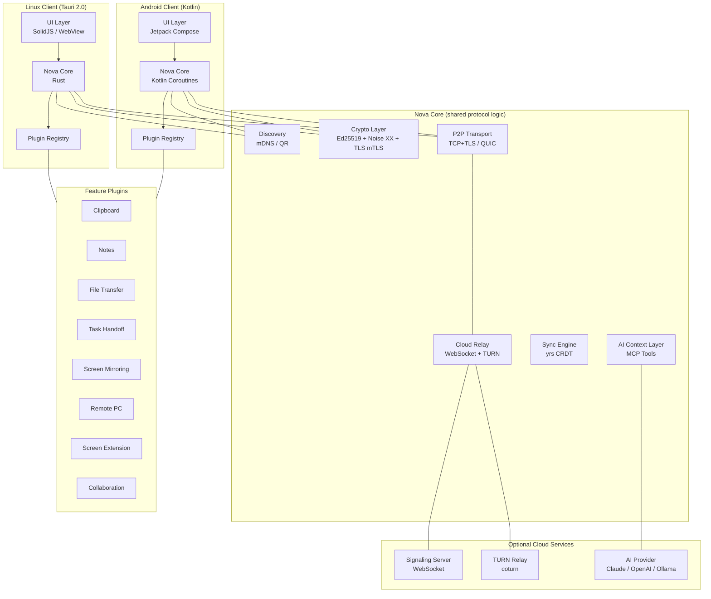
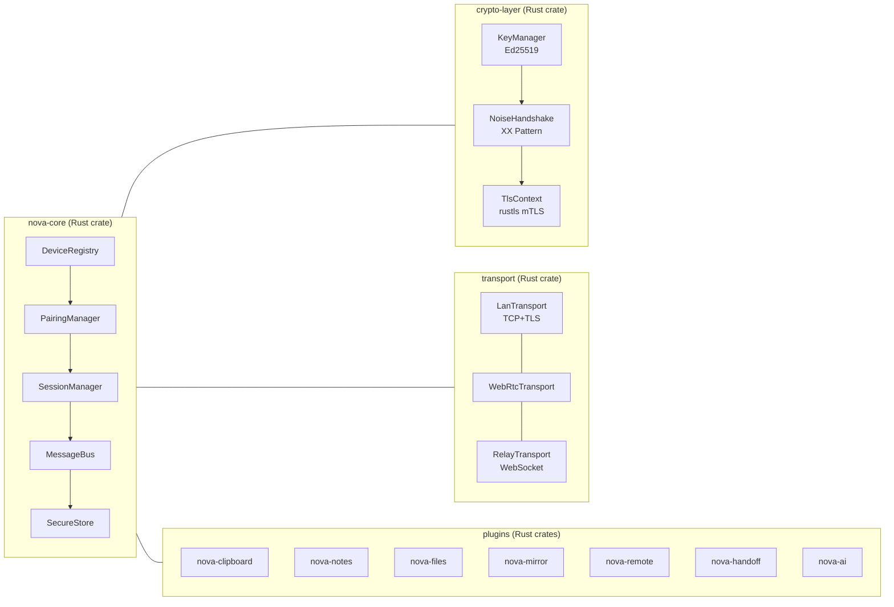
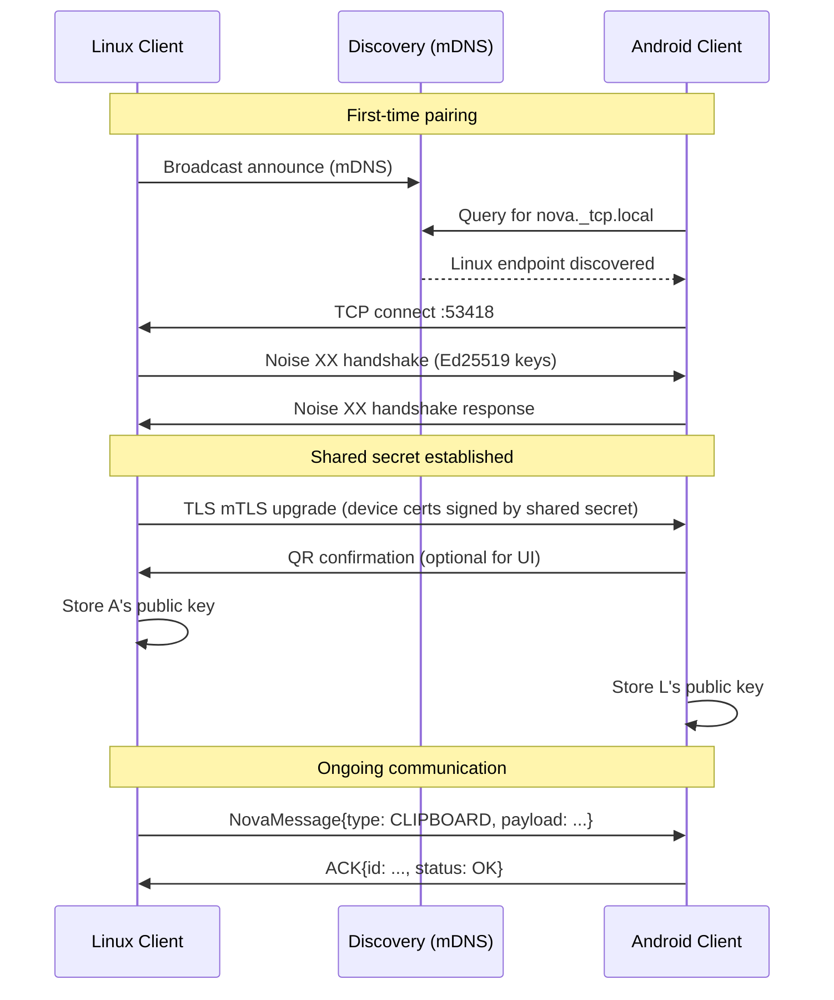
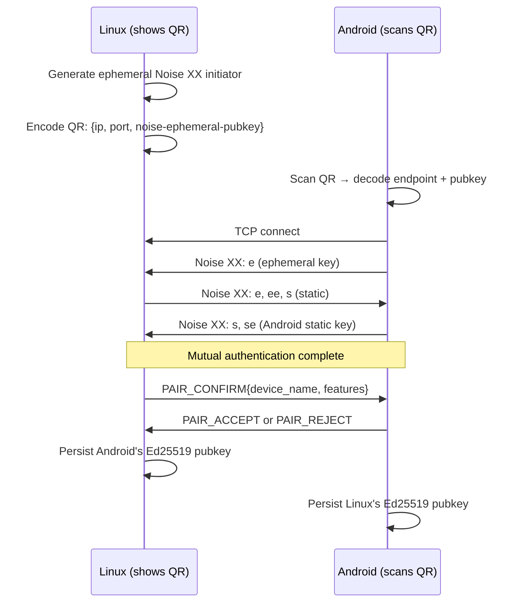
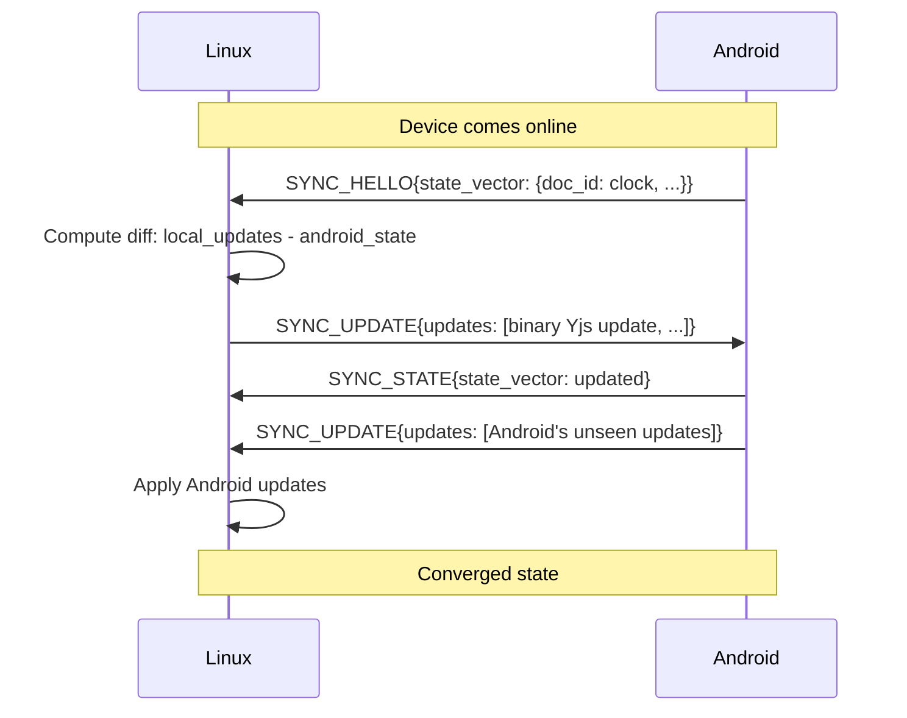
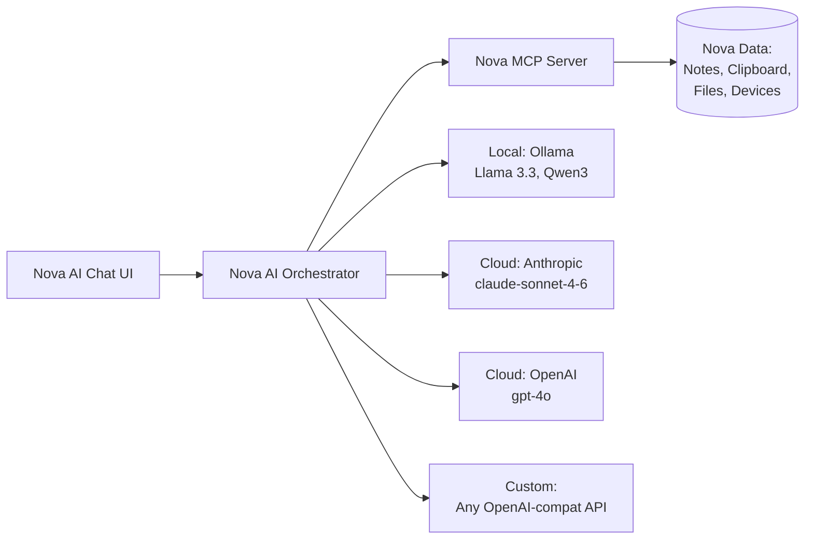
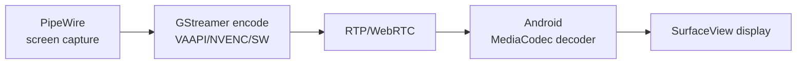
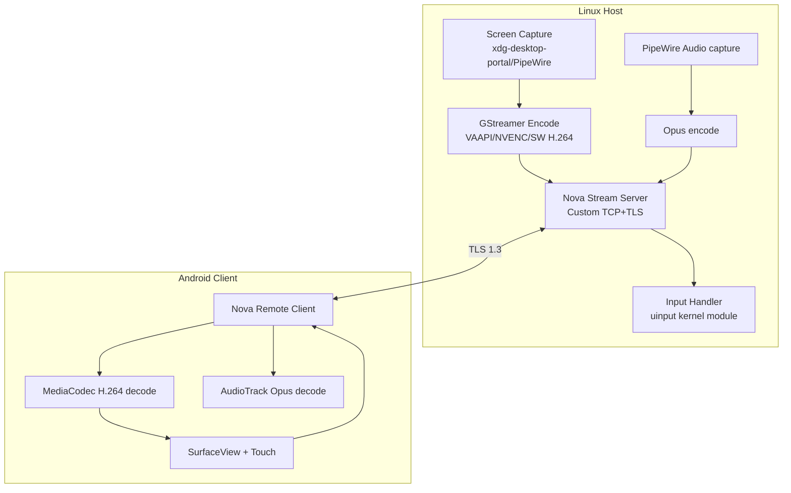

# NOVA — Research & Implementation Specification
### Cross-Device Linux ↔ Android Continuity Ecosystem
**Version:** 0.1-DRAFT | **Date:** September 2026 | **Status:** Implementation-Ready

---

## Table of Contents

1. [Executive Summary](#1-executive-summary)
2. [Product Definition](#2-product-definition)
3. [Existing Ecosystem Analysis](#3-existing-ecosystem-analysis)
4. [Open-Source Projects Discovered](#4-open-source-projects-discovered)
5. [OSS License Audit](#5-oss-license-audit)
6. [Build vs. Buy vs. Integrate Analysis](#6-build-vs-buy-vs-integrate-analysis)
7. [Recommended Architecture](#7-recommended-architecture)
8. [Technology Choices](#8-technology-choices)
9. [Device Discovery Architecture](#9-device-discovery-architecture)
10. [Security Architecture](#10-security-architecture)
11. [Clipboard Architecture](#11-clipboard-architecture)
12. [Notes Synchronization Architecture](#12-notes-synchronization-architecture)
13. [File Transfer Architecture](#13-file-transfer-architecture)
14. [Task Handoff Architecture](#14-task-handoff-architecture)
15. [AI Architecture](#15-ai-architecture)
16. [Collaboration Architecture](#16-collaboration-architecture)
17. [Screen Mirroring Architecture](#17-screen-mirroring-architecture)
18. [Remote Desktop Architecture](#18-remote-desktop-architecture)
19. [Screen Extension Feasibility](#19-screen-extension-feasibility)
20. [Protocol Specification](#20-protocol-specification)
21. [Data Models](#21-data-models)
22. [API Design](#22-api-design)
23. [Repository Structure](#23-repository-structure)
24. [Development Roadmap](#24-development-roadmap)
25. [MVP Specification (v0.1)](#25-mvp-specification-v01)
26. [Testing Strategy](#26-testing-strategy)
27. [Performance Strategy](#27-performance-strategy)
28. [Deployment Strategy](#28-deployment-strategy)
29. [Privacy Model](#29-privacy-model)
30. [Risks and Mitigations](#30-risks-and-mitigations)
31. [Open-Source Integration Plan](#31-open-source-integration-plan)
32. [Exact Implementation Recommendations for Cursor](#32-exact-implementation-recommendations-for-cursor)

---

## 1. Executive Summary

Nova is a local-first, peer-to-peer, privacy-conscious ecosystem connecting Linux desktops and Android phones. It aims to make these two devices feel like extensions of the same computing environment — sharing clipboard, notes, files, tasks, screen, keyboard, and an AI context layer.

**This document is not a product brainstorm. It is an implementation specification.**

### Critical Findings

| Finding | Impact |
|---|---|
| KDE Connect already proves this product category is viable | Confirms demand; also proves GPL creates embedding barriers |
| RustDesk is AGPL-3.0 — cannot embed without open-sourcing Nova | Must build Remote PC media layer ourselves or wrap behind abstraction |
| Android clipboard is inaccessible from background since API 29 | Clipboard sync requires a persistent foreground service or IME trick |
| Wayland screen capture requires PipeWire + xdg-desktop-portal | Cannot bypass compositor permission layer — this is correct behaviour |
| True OS-level screen extension (virtual monitor) is compositor-dependent | Must scope carefully: GNOME/KDE Wayland differ significantly |
| Sunshine (GPL-3.0) protocol is not embeddable without GPL | For Remote PC, Nova must implement its own streaming pipeline |
| Yjs (MIT) is the right CRDT for notes | Best performance, widest editor integration, permissive license |
| LocalSend protocol (Apache 2.0) is ideal for file transfer | Full protocol spec is open, clean REST over HTTPS, mDNS discovery |
| Noise Protocol XX pattern is the right pairing primitive | Used by WireGuard, WhatsApp; Rust implementations exist under Apache 2.0 |

### Recommended Stack

- **Core language:** Rust (performance, safety, cross-platform)
- **Linux client:** Tauri 2.0 (Rust + Web UI, avoids Qt GPL problems)
- **Android client:** Kotlin + Jetpack Compose
- **Transport:** TLS 1.3 with mutual authentication (device certificates)
- **Discovery:** mDNS/DNS-SD (avahi on Linux, NsdManager on Android)
- **CRDT:** Yjs (MIT) via `yrs` Rust bindings
- **File transfer:** LocalSend-compatible protocol (Apache 2.0) extended
- **Screen mirroring:** PipeWire → FFmpeg/GStreamer encode → WebRTC or direct RTP
- **Security:** Ed25519 keys, Noise XX handshake, then TLS mTLS sessions
- **AI:** MCP tool server (local HTTP), connects to Ollama / Claude / OpenAI

---

## 2. Product Definition

### 2.1 Core Capabilities

| ID | Feature | Phase |
|---|---|---|
| F01 | Continuous Notes Sync | 3 |
| F02 | Super Clipboard (text, images, files) | 2 |
| F03 | Remote PC (screen + input) | 8 |
| F04 | Nova AI Assistant | 6 |
| F05 | Screen Mirroring | 7 |
| F06 | Screen Extension (virtual second monitor) | 10 |
| F07 | Task Handoff | 5 |
| F08 | Infinite Collaboration (real-time shared workspaces) | 9 |
| F09 | Multi-device Notes Sync | 3 |
| F10 | File EasyShare | 4 |

### 2.2 Design Principles (Non-Negotiable)

1. **Local-first:** Every feature works on LAN. Cloud relay is fallback, not default.
2. **Privacy-by-default:** No telemetry. No required cloud accounts. Data stays on user devices.
3. **P2P-first:** Direct encrypted connections between paired devices. No intermediary unless NAT requires it.
4. **Secure by default:** Cryptographic device identity from first launch. No plaintext channels.
5. **Modular:** Each subsystem (clipboard, notes, files) is independently functional.
6. **Open-source friendly:** License must permit this. Apache 2.0 for Nova's own code.

### 2.3 Target Users

- Developers and power users running Linux desktop daily
- Users who carry an Android phone as their primary mobile device
- People who dislike cloud-dependent cross-device solutions (iCloud, Microsoft Phone Link, etc.)

---

## 3. Existing Ecosystem Analysis

### 3.1 KDE Connect — Closest Existing Solution

**What it is:** Mature, GPL-2.0, Qt/C++ cross-device app covering clipboard, notifications, file sharing, remote input, and media control between Linux and Android.

**What Nova can learn from it:**
- Plugin architecture: each feature is a "plugin" with its own protocol packets. Nova should adopt the same modularity.
- Device identity via TLS certificates generated on first launch. Nova uses the same approach.
- Uses port 1716 TCP/UDP for LAN communication.

**Why Nova is not KDE Connect:**
- KDE Connect requires KDE Plasma framework dependencies on Linux. Nova is desktop-agnostic.
- KDE Connect does not have notes sync, CRDT collaboration, AI context, or screen extension.
- KDE Connect's protocol is not designed for local-first CRDT sync.
- KDE Connect Android app: GPL-2.0. Embedding its code requires GPL. Nova must not copy code.
- Nova protocol must be cleanly designed from scratch, taking KDE Connect as *architectural* inspiration only.

**Verdict:** Study architecture and protocol semantics. Do **not** copy any code. Do not use KDE Connect as a library.

### 3.2 GSConnect

GNOME Shell extension implementing the KDE Connect protocol. Useful for confirming protocol interoperability patterns. GPL-2.0. Same licensing conclusion: study, do not embed.

### 3.3 LocalSend

**What it is:** Flutter-based LAN file sharing app. Protocol is a simple REST API over HTTPS with mDNS discovery. Apache 2.0 licensed.

**Nova can:**
- Adopt the LocalSend Protocol v2.1 specification for Nova's file transfer layer (the spec itself is not copyrightable implementation)
- Implement compatibility so Nova devices can send to/receive from LocalSend clients
- The Rust implementation `localsend-rs` (Apache 2.0) can be referenced or adapted

**Verdict:** Adopt LocalSend-compatible protocol for file transfer. Implement natively in Rust. Do not depend on the Flutter app itself.

### 3.4 Syncthing

**What it is:** Decentralized, continuous file synchronization. MPL-2.0. Go binary.

**For Notes Sync:** Syncthing is file-level sync. It has no conflict resolution beyond "newer file wins" for different files. CRDT is superior for notes.

**For File EasyShare:** Syncthing is folder-based and too heavy-weight for ad-hoc file sharing. LocalSend-style protocol is better.

**Verdict:** Do not use for notes. Optionally allow Syncthing as a "bring your own sync backend" for File EasyShare in a later phase. Nova's own protocol is primary.

### 3.5 RustDesk

**What it is:** AGPL-3.0 remote desktop app in Rust + Flutter. Full screen streaming + input. Mature.

**AGPL-3.0 implication:** Any product that uses RustDesk as a library and distributes it (even over a network) must release its own source under AGPL. This is incompatible with a proprietary or even Apache 2.0 Nova.

**What Nova can learn:**
- RustDesk uses a custom binary protocol over TCP with VP9/H264 encoding
- Their QUIC-based relay architecture for NAT traversal
- Their virtual input injection approach on Linux (libfakekey / uinput)

**Verdict:** Cannot embed. Use as architectural reference only. Nova must build its own media pipeline for Remote PC — but can reach for GStreamer (LGPL) or libav (LGPL) for codec work.

### 3.6 Sunshine + Moonlight

**Sunshine:** GPL-3.0 game-streaming host. Excellent hardware-accelerated encoding (NVENC, VAAPI, VCE).
**Moonlight:** GPL-2.0 client. Implements NVIDIA GameStream protocol (now open standard via Sunshine).

**GPL implication:** Cannot embed either. Nova must not depend on Sunshine or Moonlight binaries.

**What Nova can learn:**
- NVIDIA GameStream protocol (RTSP-based control, RTP for video/audio)
- Hardware encoder selection strategy: NVENC → VAAPI → VCN → software
- Moonlight protocol message framing for remote input

**Verdict:** Cannot use. Build Nova Remote PC independently. Use GStreamer (LGPL) + uinput (Linux kernel interface) for the streaming pipeline. This avoids GPL. Design a clean, efficient custom streaming protocol.

### 3.7 scrcpy

**What it is:** Apache 2.0 Android screen mirroring + control tool. C (Linux host) + Java (Android server). Extremely mature.

**Nova can:**
- **Directly embed scrcpy's Android server component** (Apache 2.0 allows this)
- The server APK deploys via ADB and streams H.264/H.265/AV1 via socket
- scrcpy's protocol is documented and clean

**For Android → Linux screen mirroring:** scrcpy's Android server does exactly this. Nova Linux client can speak the scrcpy protocol.

**Verdict:** Embed scrcpy server for Android→Linux mirroring. Excellent fit. Apache 2.0. **This is the highest-value integration in the entire project.**

### 3.8 Weylus

**What it is:** Rust-based tool that turns tablets/phones into a graphics tablet/screen for Linux. Apache 2.0.

Uses `uinput` for Linux input injection, WebSocket for transport, H.264 via GStreamer or FFmpeg.

**Nova can learn:**
- How to use uinput on Linux for synthetic input
- WebSocket + H.264 transport pattern over LAN

**Verdict:** Study uinput integration patterns. Do not embed Weylus directly; it's a different use case.

### 3.9 Input Leap / Barrier

Mouse/keyboard sharing between Linux machines. GPL. Not relevant to Linux↔Android use case.

### 3.10 Deskreen

Electron-based screen sharing to browsers via WebRTC. AGPL-2.0. Uses PipeWire.

**Verdict:** AGPL is problematic. Architectural reference only: PipeWire → WebRTC encode pattern is confirmed viable.

### 3.11 wayvnc

VNC server for wlroots compositors. Uses PipeWire screen capture and NeatVNC. MIT/ISC licensed.

**This is embeddable.** wayvnc + NeatVNC can provide VNC-over-LAN for Remote PC on wlroots compositors.

**Verdict:** Evaluate as embedded option for Remote PC on wlroots (Sway, Hyprland, etc.). NeatVNC is MIT. Potentially wrap wayvnc for Nova Remote PC, falling back to a custom pipeline for GNOME/KDE.

---

## 4. Open-Source Projects Discovered

| Project | Purpose in Nova | Language | Stars (approx.) | Active? |
|---|---|---|---|---|
| KDE Connect | Architecture reference, protocol inspiration | C++/Qt | 4k+ | Yes |
| scrcpy | Android→Linux screen mirror (embed server) | C/Java | 110k+ | Yes |
| LocalSend | File transfer protocol & reference implementation | Dart/Rust | 50k+ | Yes |
| Syncthing | Architecture reference for sync; optional backend | Go | 65k+ | Yes |
| RustDesk | Remote desktop reference | Rust/Flutter | 75k+ | Yes |
| Sunshine | Streaming pipeline reference (GPL: no embed) | C++ | 20k+ | Yes |
| Moonlight | Streaming client reference | Multi | 15k+ | Yes |
| wayvnc | VNC for wlroots compositors | C | 1.5k+ | Yes |
| NeatVNC | Minimal VNC server library | C | 500+ | Yes |
| Weylus | Input injection via uinput | Rust | 4k+ | Yes |
| Yjs | CRDT notes sync | JS/Rust (`yrs`) | 17k+ | Yes |
| yrs | Yjs in Rust | Rust | 2k+ | Yes |
| Automerge | Alternative CRDT (JSON model) | Rust/JS | 7k+ | Yes |
| libp2p-noise | Noise Protocol for Rust | Rust | N/A | Yes |
| snow (crate) | Pure Rust Noise Protocol | Rust | 700+ | Yes |
| noise-framework | Apache 2.0 Noise in Rust | Rust | 200+ | Yes |
| avahi | mDNS/DNS-SD on Linux | C | N/A | Yes |
| xdg-desktop-portal | Wayland screen capture portal | C | N/A | Yes |
| GStreamer | Multimedia pipeline (encode/decode) | C/Rust | 7k+ | Yes |
| FFmpeg | Codec library | C | 45k+ | Yes |
| webrtc-rs | WebRTC in Rust | Rust | 3k+ | Yes |
| lamco-portal | Rust xdg-desktop-portal bindings | Rust | New | Yes |
| sqlx | Async Rust SQL | Rust | 13k+ | Yes |
| SQLite | Embedded DB | C | N/A | Yes |
| libsecret | Linux secret storage | C | N/A | Yes |
| Tauri | Rust desktop app framework | Rust/JS | 85k+ | Yes |
| wlroots | Wayland compositor library (headless outputs) | C | 3k+ | Yes |
| uinput | Linux virtual input kernel interface | Kernel | N/A | N/A |

---

## 5. OSS License Audit

> **Legend:** ✅ = Can embed/distribute freely | ⚠️ = Conditions apply | ❌ = Incompatible with proprietary/Apache

| Project | License | Can Embed? | Can Modify? | Can Distribute? | Key Risk |
|---|---|---|---|---|---|
| KDE Connect (kdeconnect-kde) | GPL-2.0-or-later | ❌ | ✅ (fork) | ⚠️ GPL only | Copyleft infection |
| KDE Connect (Android) | GPL-2.0-or-later | ❌ | ✅ (fork) | ⚠️ GPL only | Copyleft infection |
| scrcpy | Apache 2.0 | ✅ | ✅ | ✅ | None |
| scrcpy Android server | Apache 2.0 | ✅ | ✅ | ✅ | None |
| LocalSend (app) | Apache 2.0 | ✅ | ✅ | ✅ | None |
| LocalSend Protocol spec | MIT | ✅ | ✅ | ✅ | None |
| localsend-rs | MIT | ✅ | ✅ | ✅ | None |
| Syncthing | MPL-2.0 | ⚠️ | ✅ | ✅ | File-level copyleft; modifications to MPL files must be open |
| RustDesk | AGPL-3.0 | ❌ | ✅ (fork) | ⚠️ AGPL only | Network copyleft |
| Sunshine | GPL-3.0 | ❌ | ✅ (fork) | ⚠️ GPL only | Copyleft infection |
| Moonlight (Android) | GPL-2.0 | ❌ | ✅ (fork) | ⚠️ GPL only | Copyleft infection |
| wayvnc | MIT | ✅ | ✅ | ✅ | None |
| NeatVNC | ISC | ✅ | ✅ | ✅ | None |
| Weylus | Apache 2.0 | ✅ | ✅ | ✅ | None |
| Yjs | MIT | ✅ | ✅ | ✅ | None |
| yrs (Yjs Rust) | MIT | ✅ | ✅ | ✅ | None |
| Automerge | MIT | ✅ | ✅ | ✅ | None |
| libp2p-noise | Apache 2.0 | ✅ | ✅ | ✅ | None |
| snow (Noise/Rust) | Apache 2.0 | ✅ | ✅ | ✅ | None |
| GStreamer core | LGPL-2.0 | ⚠️ | ✅ | ✅ | LGPL: link dynamically or open modifications |
| GStreamer plugins-base | LGPL-2.0 | ⚠️ | ✅ | ✅ | Same |
| GStreamer plugins-bad/ugly | GPL/proprietary | ❌ | varies | varies | Don't use ugly; GPL bad plugins require GPL |
| FFmpeg (libav*) | LGPL-2.1 (most) | ⚠️ | ✅ | ✅ | Link dynamically; some codecs are GPL |
| webrtc-rs | MIT | ✅ | ✅ | ✅ | None |
| Tauri | MIT/Apache 2.0 | ✅ | ✅ | ✅ | None |
| wlroots | MIT | ✅ | ✅ | ✅ | None |
| xdg-desktop-portal | LGPL-2.1 | ⚠️ | ✅ | ✅ | Link dynamically |
| avahi | LGPL-2.1 | ⚠️ | ✅ | ✅ | Link dynamically or use D-Bus IPC (safe) |
| libsecret | LGPL-2.1 | ⚠️ | ✅ | ✅ | Link dynamically |
| SQLite | Public Domain | ✅ | ✅ | ✅ | None |
| sqlx | MIT/Apache 2.0 | ✅ | ✅ | ✅ | None |
| lamco-portal | MIT | ✅ | ✅ | ✅ | None |
| GSConnect | GPL-2.0 | ❌ | ✅ (fork) | ⚠️ GPL only | Copyleft |

**Summary rule for Nova:** Use Apache 2.0 or MIT libraries wherever possible. For LGPL libraries (GStreamer, avahi, FFmpeg, libsecret, xdg-desktop-portal), **link dynamically** and keep modifications separate. Never embed GPL or AGPL code.

---

## 6. Build vs. Buy vs. Integrate Analysis

### 6.1 Decision Matrix

| Subsystem | Decision | Rationale |
|---|---|---|
| Device discovery | **Build** (mDNS via system API) | avahi (LGPL) via D-Bus IPC is safe on Linux; NsdManager on Android. Thin wrapper, not embedding. |
| Pairing/security | **Build** | Noise Protocol (Apache 2.0 Rust crate `snow`) + Ed25519. Cannot delegate trust to any OSS project. |
| File transfer | **Integrate protocol** | LocalSend Protocol v2.1 spec (Apache 2.0). Implement in Rust ourselves. Interoperability with LocalSend app is a bonus. |
| Clipboard sync | **Build** | No suitable OSS solution respects Android API 29+ restrictions. Must build foreground service + custom sync protocol. |
| Notes sync | **Integrate** | `yrs` (Yjs in Rust, MIT). Use directly as a library. Proven, fast, editor-agnostic. |
| Android→Linux mirroring | **Integrate** (scrcpy Android server) | scrcpy Android server is Apache 2.0. Deploy it as APK, speak the scrcpy protocol on the Linux side. |
| Linux→Android mirroring | **Build** | PipeWire + xdg-desktop-portal → encode → stream. No suitable Apache/MIT library does this end-to-end. Use GStreamer (LGPL, dynamic). |
| Remote PC (media layer) | **Build** | Cannot use Sunshine (GPL) or RustDesk (AGPL). Build: xdg-desktop-portal capture → GStreamer encode → custom RTP transport. |
| Remote PC (input) | **Build** | Use `uinput` (Linux kernel, no license concern) for synthetic keyboard/mouse. libfakekey is MIT. |
| Screen extension | **Build (compositor-specific)** | wlroots headless output: MIT. GNOME requires gnome-shell extension (GPL concern; ship separately). |
| AI orchestration | **Build** | MCP-compatible local tool server. No embedding of model weights. Connect to Ollama/Cloud APIs. |
| Collaboration (CRDT) | **Integrate** | `yrs` (MIT). Automerge (MIT) as fallback for structured data. |
| Signaling server | **Build** | Lightweight WebSocket server for WebRTC signaling + relay fallback. Self-hostable. |
| Encryption transport | **Build** | Use `rustls` (MIT/Apache) for TLS 1.3. `snow` for Noise handshake. |
| Linux desktop UI | **Build with Tauri 2.0** | Avoids Qt GPL. Rust backend + any web framework (SolidJS recommended). |
| Android UI | **Build** | Kotlin + Jetpack Compose. Native. |

---

## 7. Recommended Architecture

### 7.1 High-Level System Diagram



### 7.2 Component Architecture



### 7.3 Data Flow — Paired Device Communication



---

## 8. Technology Choices

### 8.1 Language Strategy

| Layer | Language | Reasoning |
|---|---|---|
| Core protocol, crypto, sync, transport | **Rust** | Memory safety critical for crypto code. No GC pauses for real-time features. Cross-compilation to ARM Android (NDK). `cargo` monorepo fits well. |
| Linux desktop UI | **TypeScript + SolidJS** via Tauri 2.0 | Tauri 2.0 has excellent Linux support, uses the system WebView. Avoids Qt GPL issues. Rust backend exposes commands via Tauri IPC. |
| Android app | **Kotlin** + Jetpack Compose | Native Android. Rust core exposed via JNI. Jetpack Compose for modern UI. |
| Signaling server | **Rust** (Axum + Tokio) | Consistent with core. tokio-tungstenite for WebSocket. |
| CRDT (notes) | **yrs** (Rust) | Direct Rust crate. No language boundary for sync logic. |

**Why not:**
- **Flutter:** Dart FFI to Rust is clunky. Flutter on Linux uses GTK, introducing GTK LGPL dependency. Single-codebase benefit is outweighed by native UX degradation.
- **Electron:** Heavy (200 MB+), no Rust IPC convenience, poor battery life. Tauri is 5–10 MB.
- **Qt/C++:** Qt LGPL requires dynamic linking ceremony. Qt for Android is painful. C++ memory unsafety in crypto code is a security risk.
- **Go:** Excellent for server-side but poor Android NDK support. Can't share Go code cleanly with Android.

### 8.2 Transport Stack Decision

```
LAN:    Direct TCP + TLS 1.3 (rustls)     → Primary path, lowest latency
        QUIC (quinn crate, MIT)             → For file transfer on unreliable WiFi
WAN:    WebSocket relay → TURN → Peer      → Fallback when NAT blocks direct
```

**Why not WebRTC exclusively:** WebRTC is designed for browser-to-browser. Its ICE negotiation adds 1–3 seconds of setup time. For clipboard sync on LAN, a direct TCP connection over mDNS is 10× simpler and faster. Use WebRTC selectively: screen mirroring where its codec negotiation and adaptive bitrate matter. For everything else: raw TLS.

**Why QUIC for files:** QUIC's stream multiplexing allows multiple file chunks in parallel without head-of-line blocking. The `quinn` crate (MIT) is stable and production-quality.

### 8.3 Codec Strategy (Screen/Remote)

| Priority | Codec | Hardware | Fallback |
|---|---|---|---|
| 1 | AV1 | NVENC (RTX 30+), VAAPI (RX 6000+), Intel Arc | — |
| 2 | H.265/HEVC | All modern GPUs | — |
| 3 | H.264 | All GPUs, universal decoder | — |
| 4 | VP9 | Software only | For old hardware |

Detection order via GStreamer's `gst_element_factory_find`:
1. `nvh264enc` / `nvav1enc` (NVIDIA)
2. `vah264enc` / `vaav1enc` (VAAPI)
3. `qsvh264enc` (Intel QSV)
4. `x264enc` (software, LGPL)

All GStreamer encoding elements must be from `gstreamer-plugins-base` or `gstreamer-plugins-good` (both LGPL). Avoid `gstreamer-plugins-ugly` (GPL) and `gstreamer-plugins-bad` unless explicitly audited.

### 8.4 Tauri 2.0 on Linux

Tauri 2.0 uses the system WebView:
- **GTK WebKitGTK** on Linux (WebKit2GTK, LGPL 2.1). Dynamic linking. No GPL infection.
- Rust backend communicates with frontend via Tauri's IPC `invoke` system.
- Tauri has native Linux tray icon support via `libappindicator`.

**Build requirement:** `webkit2gtk-4.1-dev`, `libayatana-appindicator3-dev` on Debian/Ubuntu.

### 8.5 Android NDK Strategy

The Rust core crates compile to Android shared libraries via:
```
rustup target add aarch64-linux-android armv7-linux-androideabi
cargo-ndk build --target aarch64-linux-android
```

JNI bridge pattern:
```kotlin
// Kotlin side
external fun novaInit(dataDir: String): Long
external fun novaHandleEvent(handle: Long, eventJson: String): String

companion object {
    init { System.loadLibrary("nova_core") }
}
```

```rust
// Rust side (nova-android-jni crate)
#[no_mangle]
pub extern "C" fn Java_dev_nova_core_NovaCore_novaInit(
    env: JNIEnv, _class: JClass, data_dir: JString,
) -> jlong {
    // ...
}
```

---

## 9. Device Discovery Architecture

### 9.1 mDNS/DNS-SD

Nova announces itself as `nova._tcp.local` on the LAN.

**Service record:**
```
_nova._tcp.local  TXT  "id=<device-uuid>"
                       "name=<human-name>"
                       "v=1"
                       "fp=<ed25519-pubkey-hex>"
                       "features=clipboard,notes,files"
```

**Linux implementation:**
- Use `avahi-daemon` via D-Bus IPC (safe — no LGPL linking). Crate: `zeroconf` (MIT) or direct D-Bus via `zbus` (Apache 2.0).
- Alternatively use `mdns-sd` crate (MIT) for pure Rust mDNS without avahi dependency.

**Android implementation:**
- `NsdManager` (Android API 16+). `registerService` / `discoverServices`.
- `NsdManager` uses Bonjour/mDNS under the hood.

### 9.2 Bluetooth Discovery (Fallback)

For devices not on the same network (e.g., tethering scenario):

**Android:** BluetoothLeAdvertiser + BLE scan for service UUID `00001234-0000-1000-8000-00805f9b34fb` (Nova-specific UUID).
**Linux:** BlueZ (GPL but accessed via D-Bus — safe). `bluez` D-Bus API for scanning.

BLE discovery only provides the IP endpoint. Connection still goes over TCP/TLS.

### 9.3 QR Code Pairing (First-time)



### 9.4 Discovery Protocol Flow

```
Device boot:
1. Generate Ed25519 keypair (if not exists), store in secure storage
2. Start mDNS announcer (1s interval for 30s, then 15s interval)
3. Start mDNS browser, collect discovered Nova devices
4. For each discovered device with known pubkey: auto-connect
5. For each discovered device with unknown pubkey: show in "Nearby devices" list

Connection lifecycle:
- Keep-alive: PING every 30s over established TLS session
- If PING fails 3 times: mark offline, attempt reconnect
- Reconnect: exponential backoff 1s, 2s, 4s, 8s, capped at 60s
```

### 9.5 WAN / NAT Traversal

```
Attempt 1: Direct LAN connection (mDNS)
Attempt 2: WebRTC ICE (STUN: stun.l.google.com:19302 as default fallback)
Attempt 3: Relay via Nova signaling server (self-hostable; Anthropic can run public instance)
Attempt 4: TURN relay (coturn, also self-hostable)
```

Signal server: lightweight Rust + Axum + WebSocket. Devices register by pubkey, relay SDP offers/answers for WebRTC peer connection. Server sees only encrypted blobs — cannot read payload.

---

## 10. Security Architecture

### 10.1 Threat Model

| Threat | Mitigation |
|---|---|
| LAN attacker reads clipboard | TLS mTLS. All data encrypted in transit. |
| Rogue device impersonates known device | Ed25519 device identity. Pin pubkey on first connect. TOFU with QR verification. |
| Relay server reads data | E2E encryption. Relay only sees ciphertext. |
| Compromised device in trusted set | Per-device revocation list stored locally. Revoke = remove pubkey. |
| Physical access to device, stolen keys | Keys in Android Keystore (hardware-backed on API 28+). Linux: libsecret / kernel keyring. |
| Replay attacks | Nonce in every message. 64-bit monotonic counter per session. |
| Man-in-the-middle on first QR | QR embeds ephemeral Noise key. MitM would need to intercept QR display in real time. |
| Malicious app reads clipboard on Android | Nova clipboard sync is user-initiated or consent-based on each copy. |

### 10.2 Device Identity

```
Key generation (first launch):
1. Generate Ed25519 keypair
2. Derive device UUID: SHA3-256(pubkey)[0:16] as UUID v5
3. Store private key in:
   - Android: Android Keystore (hardware-backed StrongBox if available)
   - Linux: libsecret (GNOME keyring / KWallet) or encrypted file under ~/.local/share/nova/

Key fingerprint for UI display:
   SHA3-256(pubkey) → encode as mnemonic phrase (BIP-39 or PGP word list)
   Display last 4 words for visual verification: "apple tiger forest moon"
```

### 10.3 Noise Protocol XX Handshake

The Noise `XX` pattern provides:
- Mutual authentication (both parties prove identity)
- Identity hiding (static keys not revealed to passive observer)
- Forward secrecy (ephemeral keys per session)

Pattern:
```
XX:
  → e
  ← e, ee, s, es
  → s, se
```

After handshake: derive 256-bit symmetric key (ChaCha20-Poly1305) for session.

Implementation: `snow` crate (Apache 2.0), or `noise-framework` crate (Apache 2.0).

### 10.4 TLS Session (Post-Handshake)

After Noise handshake, derive TLS certificate from shared secret:
- Generate self-signed X.509 cert for device (use `rcgen` crate, MIT)
- Cert contains device UUID in Subject Alternative Name
- Both parties present cert via mTLS (`rustls`, MIT/Apache)
- Session established; subsequent connections skip Noise, verify cert directly (TOFU)

### 10.5 Permission Model

```rust
pub enum Permission {
    ClipboardRead,
    ClipboardWrite,
    NotesSyncRead,
    NotesSyncWrite,
    FileReceive,
    FileSend,
    ScreenMirrorShare,
    RemoteInputControl,
    ScreenCapture,
    TaskHandoff,
    AIContextAccess,
}

pub struct DeviceTrust {
    pub device_id: Uuid,
    pub pubkey: Ed25519PublicKey,
    pub granted: HashSet<Permission>,
    pub revoked: bool,
    pub last_seen: SystemTime,
    pub label: String, // User-assigned name
}
```

User can revoke any permission or entire device from Settings at any time. Revocation is immediate and persisted.

### 10.6 Encrypted Local Storage

All Nova local data at rest uses SQLite with **SQLCipher** (BSD, but check licensing per build) or application-layer encryption with AES-256-GCM:

```
Data encryption key: Derived via HKDF from:
  - Device private key (Ed25519 scalar)
  - Machine-specific secret (e.g., TPM / Secure Enclave seed)
Stored: Only in system keyring. Never on disk plaintext.
```

---

## 11. Clipboard Architecture

### 11.1 The Android Problem (Critical)

**Since Android 10 (API 29):** Background apps cannot read clipboard. Only the focused app or the default IME can call `ClipboardManager.getPrimaryClip()`.

**Since Android 12 (API 31):** When any app reads clipboard, a Toast notification fires. Users see it.

**Since Android 13 (API 33):** System auto-clears clipboard after some time.

**Implications for Nova:**
1. Nova cannot silently read clipboard from background.
2. Any clipboard read triggers a user-visible toast (Android 12+).
3. **Nova must be transparent about clipboard access — this is actually good for privacy.**

### 11.2 Clipboard Sync Strategy

#### Linux → Android (easier)

Linux has no background restrictions on clipboard access. Nova daemon can use `wl-clipboard` APIs on Wayland or `xclip`/`xsel` on X11.

On Wayland, use `wlr-data-control` protocol (supported on wlroots compositors) or `xdg-desktop-portal` data transfer for GNOME/KDE:
```rust
// Use wl-clipboard-rs crate (MIT) or direct protocol
// wl-clipboard-rs: https://github.com/YaLTeR/wl-clipboard-rs
use wl_clipboard_rs::copy::{MimeType, Source, Options};
use wl_clipboard_rs::paste::{get_contents, ClipboardType, Seat};
```

On X11: use `x11-clipboard` crate (MIT).

Linux clipboard changes → Nova detects via clipboard change listener → sends `CLIPBOARD_UPDATE` message to paired Android device.

#### Android → Linux (hard)

**Option A: Foreground Service with Notification** (Recommended)
- Nova runs as a Foreground Service (persistent notification, acceptable UX)
- User explicitly taps "Send clipboard to PC" from the Nova quick-tile in notification shade
- Or: Nova monitors `ClipboardManager.OnPrimaryClipChangedListener` — this fires on foreground app changes even in background service, BUT reading the actual content requires the service to have focus or be IME

**Option B: Accessibility Service** (Power user option)
- `AccessibilityService` with `FLAG_REQUEST_FILTER_KEY_EVENTS`
- Can intercept clipboard operations
- Requires user to manually enable in Android Accessibility Settings
- Warning: Accessibility permission is very powerful; must be clearly disclosed

**Option C: Quick Settings Tile** (Best UX)
- User adds Nova tile to Quick Settings panel
- Tap tile → Nova reads clipboard (foreground context brief moment) → sends to Linux
- Works on Android 7+ (API 24+)
- No background restrictions apply when tile is tapped

**Recommended: Combination of Option A (monitoring) + Option C (send action):**

```kotlin
class NovaClipboardService : TileService() {
    override fun onClick() {
        // Tile tap gives us foreground context briefly
        val clipboard = getSystemService(ClipboardManager::class.java)
        val clip = clipboard.primaryClip ?: return
        val text = clip.getItemAt(0).coerceToText(this).toString()
        // Send to Linux via Nova transport
        NovaTransport.getInstance().sendClipboard(ClipboardPayload(text))
        qsTile.state = Tile.STATE_INACTIVE
        qsTile.updateTile()
    }
}
```

### 11.3 Clipboard Data Types

```rust
pub enum ClipboardContent {
    Text(String),
    Html { html: String, plain_fallback: String },
    Image { mime: String, data: Vec<u8>, width: u32, height: u32 },
    Uri(String),
    Files(Vec<FileReference>),
}

pub struct ClipboardUpdate {
    pub source_device: Uuid,
    pub timestamp: SystemTime,
    pub content: ClipboardContent,
    pub sensitive: bool, // If true, don't store in history
}
```

### 11.4 Clipboard History (Super Clipboard)

Store last N clipboard entries (default: 50) per device, encrypted at rest:
- Text: stored as-is
- Images: stored compressed (WebP), max 4MB
- Files: stored as reference only (path/URI), content not copied unless user explicitly shares

Clipboard history is device-local by default. Not synced. User can opt-in to cross-device clipboard history.

### 11.5 Clipboard Security

- Clipboard containing passwords (detected by heuristic or `EXTRA_IS_SENSITIVE` on Android) is marked `sensitive=true`
- Sensitive clipboard entries are:
  - Not stored in history
  - Not shown in UI previews
  - Auto-deleted from transport after delivery
  - User must opt in explicitly to cross-device sync of sensitive content

---

## 12. Notes Synchronization Architecture

### 12.1 CRDT Choice: Yjs via `yrs`

**Decision: Use `yrs` (Rust) as the CRDT engine.**

Why Yjs over Automerge:
- Yjs has been production-proven in Notion, JupyterLab, and many collaborative editors
- `yrs` (Yjs in Rust) is MIT, stable, and actively maintained
- Performance: Yjs is significantly faster than Automerge 2.x for text operations; Automerge 3.0 closed the gap but is newer/less battle-tested
- Editor ecosystem: Yjs has first-class bindings for TipTap, ProseMirror, CodeMirror, Monaco. Nova's Linux client (web-based via Tauri) can use these directly
- Binary protocol: compact update vectors

**Automerge as backup:** For highly-structured data (tasks, key-value sync), Automerge's JSON model is cleaner than Yjs Maps. May use Automerge for non-text data types.

### 12.2 Note Data Model

```rust
use yrs::{Doc, Text, Map, Transact};

// Each note is a Yjs document
pub struct NoteDoc {
    pub id: Uuid,
    pub ydoc: Doc,
    // Inside ydoc:
    // root.get("content") -> YText (rich text content)
    // root.get("meta")    -> YMap { title, created_at, tags, ... }
}

// Nova notes format: subset of CommonMark + custom blocks
// Stored as Y.Text with inline formatting marks (Peritext CRDT style)
```

### 12.3 Sync Protocol



The Yjs `stateVector` encodes each client's logical clock. Diffing two state vectors shows exactly which updates are missing on each side.

### 12.4 Offline Editing

```
Scenario: User edits note on phone while offline

1. Phone: Apply edit to local YDoc
2. Phone: Append update to local pending queue (SQLite)
3. Phone reconnects to Linux:
4. Phone: Send state vector to Linux
5. Linux: Send all updates phone hasn't seen
6. Phone: Apply Linux updates
7. Phone: Send its pending updates
8. Linux: Apply phone updates
9. Both: Converged. No conflicts possible (CRDT property).
```

### 12.5 Storage Strategy

```
SQLite database per device (nova.db):
  notes table:
    id TEXT PRIMARY KEY,          -- UUIDv4
    ydoc_state BLOB NOT NULL,      -- Serialized Yjs document state
    state_vector BLOB NOT NULL,    -- Yjs state vector for sync
    title TEXT,                    -- Denormalized for listing
    updated_at INTEGER,            -- Unix timestamp
    deleted INTEGER DEFAULT 0

  sync_log table:
    id INTEGER PRIMARY KEY,
    doc_id TEXT,cargo test -p nova-crypto
    update_data BLOB,              -- Pending Yjs updates to send
    sent INTEGER DEFAULT 0,
    created_at INTEGER
```

### 12.6 Note Editor (Linux)

Tauri WebView hosts a TipTap editor (MIT):
```typescript
import { Editor } from '@tiptap/core'
import { ySyncPlugin, yCursorPlugin, yUndoPlugin } from 'y-prosemirror'
import * as Y from 'yjs'

// The Y.Doc is shared between editor and Nova sync engine
// Nova sync engine runs in Rust, exposes JS-callable API via Tauri invoke
const ydoc = new Y.Doc()
const editor = new Editor({
  extensions: [StarterKit, Collaboration.configure({ document: ydoc })],
})
```

### 12.7 Note Editor (Android)

Custom Compose-based rich text editor backed by `yrs` Android bindings (or custom serialization bridge):
```kotlin
// yrs-android: JNI wrapper around yrs crate
class NoteViewModel(private val doc: YDoc) : ViewModel() {
    val text = doc.getText("content")
    // Observe Yjs updates → update Compose state
    val content = mutableStateOf(text.toString())
    init {
        text.observe { event ->
            content.value = text.toString()
        }
    }
}
```

---

## 13. File Transfer Architecture

### 13.1 Protocol: LocalSend-Compatible

Adopt LocalSend Protocol v2.1 as Nova's file transfer protocol. This provides:
- LAN-first: No internet required
- REST API over HTTPS: Simple, debuggable
- Automatic device discovery via mDNS
- Peer-to-peer: No server intermediary on LAN
- Interoperability: LocalSend app users can also receive from Nova

### 13.2 Transfer Flow

```mermaid
sequenceDiagram
    participant S as Sender (Linux)
    participant R as Receiver (Android)

    S->>R: POST /api/localsend/v2/prepare-upload
         (fileId, fileName, size, sha256, mimeType)
    R->>R: User sees receive prompt (or auto-accept if trusted)
    R->>S: 200 OK {token: "<session-token>"}
    loop For each chunk
        S->>R: POST /api/localsend/v2/upload
             (fileId, token, chunk data, chunkIndex)
        R->>S: 200 OK
    end
    S->>R: POST /api/localsend/v2/finalize {fileId}
    R->>R: Verify SHA-256 integrity
    R->>S: 200 OK
```

### 13.3 Transport Selection

```
File size < 50MB AND LAN available: Direct TCP/HTTPS (LocalSend protocol)
File size > 50MB AND LAN available: QUIC (quinn) with parallel streams
LAN not available:                   Relay via signaling server + encrypted tunnel
Very large files (>1GB):             Syncthing-style chunked sync with resume
```

### 13.4 Chunking and Resumability

```rust
const CHUNK_SIZE: usize = 4 * 1024 * 1024; // 4MB chunks

pub struct TransferSession {
    pub id: Uuid,
    pub file_path: PathBuf,
    pub total_size: u64,
    pub chunk_count: u64,
    pub completed_chunks: BTreeSet<u64>,
    pub sha256: [u8; 32],
    pub created_at: SystemTime,
}

// Resume: sender asks "which chunks do you have?"
// Receiver responds with BitVec of completed chunks
// Sender only transmits missing chunks
```

### 13.5 Integrity Verification

SHA-256 computed before transfer, verified after. Computed incrementally during transfer for streaming verification. Mismatch → reject file and request retransmit.

### 13.6 Encryption

Files encrypted in transit via TLS 1.3 session (same as all Nova communication). No separate file-level encryption needed unless user requests encrypted storage on receiver.

### 13.7 Permission Model

- Trusted device + user accepts: Auto-receive to configured folder
- Trusted device + no user interaction required: Auto-receive enabled per-device toggle
- Unknown device: Always requires explicit accept

---

## 14. Task Handoff Architecture

### 14.1 Nova Handoff Protocol

Task Handoff is a generic mechanism to continue a "context" on another device.

```rust
pub struct HandoffPayload {
    pub id: Uuid,
    pub source_device: Uuid,
    pub created_at: SystemTime,
    pub expires_at: SystemTime,         // TTL: 24h default
    pub intent: HandoffIntent,
    pub metadata: HashMap<String, Value>,
}

pub enum HandoffIntent {
    BrowseUrl {
        url: String,
        title: Option<String>,
        scroll_position: Option<f64>,
    },
    OpenFile {
        path: String,
        mime_type: String,
        cursor_position: Option<u64>,
    },
    OpenNote {
        note_id: Uuid,
        cursor_position: Option<u32>,
    },
    MapLocation {
        lat: f64,
        lon: f64,
        query: Option<String>,
    },
    PhoneCall {
        number: String,
    },
    Custom {
        app_id: String,       // e.g. "org.nova.handoff.custom"
        action: String,
        data: Value,
    },
}
```

### 14.2 Linux Integration

Linux client registers a D-Bus service: `dev.nova.Handoff` with method `SendToPhone(payload: String)`.

Browser extensions (for URL handoff):
- Firefox extension: calls `nova-url-handler` native messaging host
- Chrome extension: same pattern
- Native host: Rust binary, communicates with Nova daemon via Unix socket

System integration:
- Right-click menu entry in Nautilus/Dolphin: "Open on phone" → HandoffIntent::OpenFile
- Browser bookmarklets as fallback if extension not installed

### 14.3 Android Integration

Android `IntentFilter` handles incoming handoffs:
```xml
<intent-filter>
    <action android:name="dev.nova.action.HANDOFF" />
    <category android:name="android.intent.category.DEFAULT" />
</intent-filter>
```

Received handoff routing:
```kotlin
class HandoffReceiver : BroadcastReceiver() {
    override fun onReceive(context: Context, intent: Intent) {
        val payload = intent.getParcelableExtra<HandoffPayload>("payload")
        when (payload?.intent) {
            is HandoffIntent.BrowseUrl -> {
                val uri = Uri.parse(payload.intent.url)
                context.startActivity(Intent(Intent.ACTION_VIEW, uri))
            }
            is HandoffIntent.OpenNote -> {
                // Launch Nova notes with this note open
            }
            // ...
        }
    }
}
```

### 14.4 Reverse Handoff (Android → Linux)

Android → Linux handoff uses Android's Share Sheet:
1. User shares from any app via the Android share intent
2. Nova appears in the share sheet
3. User selects Nova → selects target device
4. Nova sends handoff payload over TLS
5. Linux client opens appropriate app:
   - URL: `xdg-open <url>`
   - File: Downloads to ~/Downloads, opens with default app
   - Note: Opens Nova note editor

---

## 15. AI Architecture

### 15.1 Design Philosophy

Nova AI is **not** an AI model. It is an **AI orchestration and context layer** that:
1. Provides relevant context from Nova's data to AI models
2. Exposes Nova capabilities as tool calls to AI models
3. Connects to local or cloud AI models based on user preference
4. Preserves privacy: user controls what context is sent to cloud models

### 15.2 Architecture: MCP-Compatible Tool Server

Nova implements a local MCP (Model Context Protocol) server that exposes Nova's data and capabilities as tools:

```rust
// Nova MCP server (HTTP on localhost:40199)
pub struct NovaMcpServer {
    pub tools: Vec<McpTool>,
}

// Available tools:
// nova_search_notes(query: String) -> Vec<NoteResult>
// nova_get_clipboard_history(n: u32) -> Vec<ClipboardEntry>
// nova_list_files(path: String) -> Vec<FileEntry>
// nova_get_device_status() -> Vec<DeviceStatus>
// nova_send_to_device(device_id: String, content: Any) -> Result
// nova_create_note(title: String, content: String) -> NoteId
// nova_handoff_url(url: String, device: String) -> Result
```

### 15.3 Model Providers



Priority order (configurable):
1. Local Ollama if running (privacy-first)
2. Cloud provider (user-selected, requires API key)

### 15.4 RAG (Retrieval-Augmented Generation)

For AI to reason over large note collections:

```
1. On note create/update: Generate embedding via local model
   - Use nomic-embed-text via Ollama (MIT license for embeddings endpoint)
   - Store embedding in SQLite with sqlite-vss extension (MIT)
   
2. On AI query:
   - Compute query embedding
   - sqlite-vss cosine similarity search → top-K notes
   - Include as context in AI prompt

3. Privacy guarantee:
   - Embeddings computed locally always
   - Note content only sent to cloud if user explicitly enables it
   - Cloud queries are opt-in, with preview of what will be sent
```

### 15.5 AI Context Data Model

```rust
pub struct AiContext {
    pub system_instructions: String,
    pub device_context: DeviceContext,
    pub authorized_data: AuthorizedData,
}

pub struct AuthorizedData {
    pub notes: Vec<NoteSnippet>,      // RAG results
    pub clipboard_history: Vec<ClipboardEntry>,  // If user permits
    pub recent_files: Vec<FileEntry>,             // If user permits
    pub device_states: Vec<DeviceStatus>,
}
```

### 15.6 Cross-Device AI Context

When AI query comes from Android phone:
1. Phone sends query to Nova AI orchestrator (running on Linux or phone itself)
2. Orchestrator fetches context from all connected devices (with permission)
3. Builds unified context (notes from all devices, clipboard, etc.)
4. Sends to AI model
5. Returns response to originating device

---

## 16. Collaboration Architecture

### 16.1 Infinite Collaboration: Design

Collaboration is built on the same Yjs/`yrs` CRDT used for personal notes sync. The difference:
- **Personal notes:** Synced only between user's own paired devices
- **Collaboration:** Synced with external users via shared workspace

### 16.2 Shared Workspace

```rust
pub struct Workspace {
    pub id: Uuid,
    pub name: String,
    pub owner: DeviceId,
    pub members: Vec<Member>,
    pub docs: HashMap<Uuid, NoteDoc>,
    pub presence: HashMap<DeviceId, PresenceState>,
}

pub struct Member {
    pub device_id: DeviceId,
    pub pubkey: Ed25519PublicKey,
    pub display_name: String,
    pub role: WorkspaceRole, // Owner, Editor, Viewer
    pub joined_at: SystemTime,
}

pub struct PresenceState {
    pub cursor_position: Option<CursorPosition>,
    pub selection: Option<TextRange>,
    pub active_doc: Option<Uuid>,
    pub last_seen: SystemTime,
}
```

### 16.3 Transport for Collaboration

LAN (same network): Direct WebRTC data channels between peers (y-webrtc pattern).
WAN: Nova signaling server acts as relay for Yjs update exchange:
```
Peer A ──update──→ SignalingServer ──update──→ Peer B
       ←──update── SignalingServer ←──update──
```

For small teams (2–5 people), P2P WebRTC works well. For larger groups, consider a Yjs-compatible sync server (e.g., y-websocket pattern, MIT licensed).

### 16.4 Presence System

```rust
// Broadcast presence updates every 2s while active
pub struct PresenceUpdate {
    pub workspace_id: Uuid,
    pub device_id: DeviceId,
    pub state: PresenceState,
    pub timestamp: SystemTime,
}
// Presence is ephemeral. Not persisted. Lost on disconnect.
```

### 16.5 Conflict Resolution

Yjs guarantees eventual consistency. For text: uses the Eg-walker / FUGUE algorithm (Yjs internal). For structured data (task lists, maps): Yjs's LWW (last-writer-wins) map with logical timestamps.

No manual conflict resolution required. This is the core value of CRDT.

---

## 17. Screen Mirroring Architecture

### 17.1 Android → Linux (scrcpy-based)

**Decision: Embed scrcpy's Android server. Implement a compatible Linux receiver in Rust.**

scrcpy Android server does:
1. Uses `MediaProjection` API to capture screen
2. Encodes to H.264/H.265/AV1 via `MediaCodec`
3. Sends encoded video over socket (TCP or USB ADB tunnel)
4. Accepts input events (touch, keyboard) on the same socket

Nova Linux client does:
1. Push scrcpy-server.apk to Android device via `adb push`
2. Start server: `adb shell CLASSPATH=/data/local/tmp/scrcpy-server.jar app_process / com.genymobile.scrcpy.Server`
3. Create ADB reverse tunnel or direct TCP connection
4. Receive H.264 stream, decode via GStreamer → display in Tauri window
5. Send input events back via scrcpy protocol

```
Android (scrcpy server) ──H.264──→ Nova Linux (scrcpy receiver)
                         ←──input── Nova Linux (mouse/touch events)
```

**Why this is correct:** scrcpy is Apache 2.0. Its protocol is clean and designed for exactly this. Implementing a compatible receiver rather than depending on the scrcpy binary gives Nova control over integration and UI.

**ADB dependency:** scrcpy requires ADB for initial deployment. Nova should either:
- Bundle `adb` binary (Apache 2.0, redistributable)
- Or use Android TCP debugging if ADB is unavailable (requires user to enable developer options)
- Or implement a standalone APK that the user installs manually (no ADB needed), accepting incoming connections on port 5555

**Better long-term: Nova Agent APK** — A dedicated Nova Android app that includes the scrcpy-compatible server component. User installs from Play Store. No ADB required. Nova Linux connects directly via TCP on LAN.

### 17.2 Linux → Android

**Decision: PipeWire → encode → stream → Decode on Android.**



**Step-by-step:**

1. **Screen capture** (Linux):
```rust
// Use xdg-desktop-portal ScreenCast interface
// lamco-portal crate (MIT) or direct ashpd (MIT)
use ashpd::desktop::screencast::{Screencast, SourceType};

let proxy = Screencast::new().await?;
let session = proxy.create_session().await?;
proxy.select_sources(&session, CursorMode::Hidden, SourceType::Monitor, false, None, PersistMode::DoNot).await?;
let response = proxy.start(&session, &WindowIdentifier::default()).await?.response()?;
// Get PipeWire node ID
let node_id = response.streams().first().unwrap().pipe_wire_node_id();
```

2. **GStreamer pipeline** (Linux):
```bash
# VAAPI hardware encode → RTP
gst-launch-1.0 \
  pipewiresrc path=<node_id> ! video/x-raw,format=BGRx \
  ! videoconvert ! video/x-raw,format=I420 \
  ! vah264enc bitrate=5000 ! h264parse \
  ! rtph264pay ! udpsink host=<android_ip> port=5005
```

3. **Android receive and display:**
```kotlin
class ScreenReceiveSession {
    private val mediaCodec = MediaCodec.createDecoderByType("video/avc")
    
    fun start(surface: Surface) {
        val format = MediaFormat.createVideoFormat("video/avc", 1920, 1080)
        mediaCodec.configure(format, surface, null, 0)
        mediaCodec.start()
        // Receive RTP packets, extract H.264 NAL units, feed to decoder
    }
}
```

### 17.3 Wayland Compositor Compatibility

| Compositor | Screen Capture Method | Status |
|---|---|---|
| GNOME (Mutter) | xdg-desktop-portal-gnome | ✅ Works, requires user permission dialog |
| KDE Plasma (KWin) | xdg-desktop-portal-kde | ✅ Works |
| Sway (wlroots) | xdg-desktop-portal-wlr | ✅ Works |
| Hyprland (wlroots) | xdg-desktop-portal-hyprland | ✅ Works |
| X11 | XRandR + Xcomposite | ✅ Works (use `ximagesrc` in GStreamer) |

### 17.4 Touch Input Forwarding (Android client controlled)

Android app receives mouse/keyboard from Linux mirroring session (rare use case). Reverse: Android touch events forwarded to Linux require uinput synthetic events:

```rust
use uinput::event::absolute::{Absolute, Multi};
use uinput::event::keyboard::Key;

let device = uinput::open("/dev/uinput")?.create()?;
// Synthesize touch event from Android touch coordinates
device.send(Absolute::Multi(Multi::X), x)?;
device.send(Absolute::Multi(Multi::Y), y)?;
device.send(Absolute::Multi(Multi::TrackingId), slot)?;
```

---

## 18. Remote Desktop Architecture

### 18.1 Overview

Remote PC = Control Linux desktop from Android phone. This is fundamentally different from screen mirroring:
- **Mirroring:** View Linux screen on Android (read-only, or read + touch as mouse)
- **Remote PC:** Full bidirectional control; Android is the controller, Linux is the host

### 18.2 Media Pipeline (Nova's Own — No GPL Dependencies)



### 18.3 Custom Streaming Protocol (Nova Remote Protocol, NRP)

**Nova Remote Protocol** is a binary protocol over TLS, inspired by but not copying NVIDIA GameStream or RDP:

```
Frame types:
  0x01  VIDEO_FRAME  { timestamp_us: u64, codec: u8, flags: u8, data: [u8] }
  0x02  AUDIO_FRAME  { timestamp_us: u64, data: [u8] }
  0x03  INPUT_EVENT  { type: u8, data: [u8] }
  0x04  SESSION_INFO { width: u32, height: u32, fps: u8, bitrate: u32 }
  0x05  PING         { id: u32 }
  0x06  PONG         { id: u32, latency_us: u32 }
  0x07  RESIZE       { width: u32, height: u32 }
  0x08  DISCONNECT   { reason: u8 }

Input event subtypes:
  0x10  MOUSE_MOVE   { x: i32, y: i32 }
  0x11  MOUSE_DOWN   { button: u8 }
  0x12  MOUSE_UP     { button: u8 }
  0x13  MOUSE_SCROLL { dx: i32, dy: i32 }
  0x14  KEY_DOWN     { code: u32, modifiers: u8 }
  0x15  KEY_UP       { code: u32, modifiers: u8 }
  0x16  TOUCH_BEGIN  { slot: u8, x: f32, y: f32 }
  0x17  TOUCH_MOVE   { slot: u8, x: f32, y: f32 }
  0x18  TOUCH_END    { slot: u8 }
  0x19  CLIPBOARD    { content: String }
```

### 18.4 Session Authentication

Remote PC requires explicit approval:
1. Android requests Remote PC session
2. Linux shows modal dialog with countdown (30s to accept/deny)
3. Optional PIN re-verification
4. Session approved → streaming begins
5. Any time: user hits physical shortcut (Ctrl+Alt+F2 or configurable) to force-disconnect

### 18.5 Latency Targets

- **LAN (Ethernet):** < 30ms glass-to-glass
- **LAN (WiFi 5GHz):** < 60ms glass-to-glass
- **WAN (relay):** < 150ms (varies by geography)

Achieved via:
- Zero-copy video path where possible (DMA-BUF for VAAPI)
- Constant bitrate video encoding (not VBR) to reduce encode variance
- Direct TCP (no WebRTC ICE overhead on LAN)
- Hardware decode on Android via MediaCodec

---

## 19. Screen Extension Feasibility

### 19.1 What Does "Screen Extension" Actually Mean?

There are four distinct concepts:

| Concept | What it means | Feasibility |
|---|---|---|
| **Screen Mirroring** | Show Linux screen on Android | ✅ Fully feasible (Phase 7) |
| **Remote Display** | Control Linux from Android (Remote PC) | ✅ Feasible (Phase 8) |
| **Virtual Second Monitor** | Android is additional display; Linux OS sees it as second monitor | ⚠️ Compositor-dependent (Phase 10) |
| **True Extended Desktop** | Windows seamlessly drag between Linux and Android | ❌ Not feasible without OS-level changes on both sides |

### 19.2 Virtual Second Monitor — Technical Analysis

**On wlroots compositors (Sway, Hyprland):**

wlroots has a `wlr-virtual-pointer-unstable-v1` and `wlr-output-management-unstable-v1` protocol. More relevantly, it has a **headless backend** that creates virtual outputs.

Tools like `wlr-randr` can enable headless outputs:
```bash
wlr-randr --output HEADLESS-1 --on --mode 1080x1920
```

Once a headless output exists, Nova can:
1. Capture that output via PipeWire (wlr-screencopy-unstable-v1 protocol)
2. Stream it to Android as a dedicated display
3. Forward touch events from Android as input to that virtual output

**On GNOME (Mutter):**

Mutter does not expose headless output creation without modifying gnome-shell. Options:
1. **gnome-shell extension:** Nova ships a GNOME extension (GPL — can be separate package) that creates a virtual monitor via Mutter's internal API
2. **`virtscreen` approach:** Use kernel DRM virtual connector (requires root or `udev` rule)
3. **Xwayland virtual display:** On Xwayland, `Xvfb` can create a virtual framebuffer, but it won't be a real GNOME workspace

**On KDE Plasma (KWin):**

KWin supports virtual monitors via scripting. A `kwin-script` can add a virtual output. Less mature than wlroots.

### 19.3 Recommendation for Phase 10

**Phase 10 deliverables (realistically):**

1. **wlroots compositors:** Full virtual monitor creation + streaming to Android. Android becomes an extended display. Windows can be dragged to it (via compositor rules).

2. **GNOME:** Ship a separate gnome-shell extension (GPL is fine as a standalone extension) that enables virtual monitor. Nova main app remains Apache 2.0.

3. **KDE:** Use KWin virtual monitor scripting.

4. **X11:** `Xvfb` virtual framebuffer + capture + stream. Limited but functional.

**What Nova should NOT promise:** Seamless window drag between Linux and Android at the OS level. The OS does not know Android is a display. Users must tell the compositor to move windows to the virtual output.

### 19.4 Timeline Reality Check

Screen extension is a Phase 10 feature. It requires:
- Phase 7 (screen mirroring) infrastructure to be complete
- Phase 8 (remote PC) input forwarding to be complete
- Compositor-specific integration to be developed separately

**Do not scope screen extension into v0.1 or v1.0.**

---

## 20. Protocol Specification

### 20.1 Nova Wire Protocol

All Nova communication uses this framing over TLS 1.3 TCP:

```
Header (8 bytes):
  [0:1]  magic: 0x4E56  ("NV")
  [2:3]  version: 0x0001
  [4:7]  payload_length: u32 (little-endian)

Payload:
  Serialized NovaMessage (MessagePack format via `rmp-serde` crate, MIT)
```

### 20.2 NovaMessage Envelope

```rust
#[derive(Serialize, Deserialize)]
pub struct NovaMessage {
    pub id: Uuid,
    pub source: DeviceId,
    pub target: DeviceId,
    pub timestamp: u64,        // Unix micros
    pub plugin: PluginId,
    pub payload: Vec<u8>,      // Plugin-specific, inner MessagePack
    pub signature: [u8; 64],   // Ed25519 over (id || source || target || timestamp || plugin || payload)
}
```

Every message is signed by source device's Ed25519 private key. Receiver verifies before processing.

### 20.3 Plugin IDs

```rust
pub const PLUGIN_CLIPBOARD: u16 = 0x0001;
pub const PLUGIN_NOTES:     u16 = 0x0002;
pub const PLUGIN_FILES:     u16 = 0x0003;
pub const PLUGIN_HANDOFF:   u16 = 0x0004;
pub const PLUGIN_MIRROR:    u16 = 0x0005;
pub const PLUGIN_REMOTE:    u16 = 0x0006;
pub const PLUGIN_AI:        u16 = 0x0007;
pub const PLUGIN_COLLAB:    u16 = 0x0008;
pub const PLUGIN_CONTROL:   u16 = 0xFF00; // Pairing, keepalive, etc.
```

### 20.4 Control Messages

```rust
// Plugin: PLUGIN_CONTROL
#[derive(Serialize, Deserialize)]
pub enum ControlMessage {
    Hello {
        version: u16,
        device_name: String,
        features: Vec<u16>,      // Supported plugin IDs
    },
    Ping { nonce: u64 },
    Pong { nonce: u64 },
    DeviceRevoked { device_id: DeviceId },
    PermissionRequest { permissions: Vec<u8> },
    PermissionGrant { permissions: Vec<u8> },
    PermissionDeny { permissions: Vec<u8> },
    Goodbye { reason: String },
}
```

### 20.5 Protocol Versioning

Nova protocol version encoded in header. Breaking changes increment major version. Nova MUST:
1. Accept connections from same major version regardless of minor
2. Reject connections from incompatible major versions with clear error
3. Negotiate lowest common feature set on Hello exchange

---

## 21. Data Models

### 21.1 Device Registry

```rust
pub struct Device {
    pub id: DeviceId,           // UUIDv5 from pubkey
    pub pubkey: Vec<u8>,        // Ed25519 public key (32 bytes)
    pub fingerprint: String,    // Mnemonic phrase for UI verification
    pub name: String,           // User-assigned label
    pub platform: Platform,     // Linux, Android
    pub features: Vec<u16>,     // Supported plugin IDs
    pub trusted: bool,
    pub permissions: HashSet<Permission>,
    pub last_seen: SystemTime,
    pub address_hints: Vec<SocketAddr>, // Last known LAN addresses
}

pub enum Platform { Linux, Android, Unknown }
```

### 21.2 Note

```rust
pub struct Note {
    pub id: Uuid,
    pub ydoc_state: Vec<u8>,    // Serialized Yjs document
    pub title: String,           // Denormalized from YDoc meta
    pub preview: String,         // First 200 chars, denormalized
    pub tags: Vec<String>,
    pub created_at: SystemTime,
    pub updated_at: SystemTime,
    pub deleted: bool,
    pub workspace_id: Option<Uuid>, // None = personal note
}
```

### 21.3 File Transfer

```rust
pub struct FileTransfer {
    pub id: Uuid,
    pub session_id: Uuid,
    pub direction: Direction,    // Incoming, Outgoing
    pub filename: String,
    pub mime_type: String,
    pub total_bytes: u64,
    pub transferred_bytes: u64,
    pub sha256: [u8; 32],
    pub state: TransferState,
    pub source_device: DeviceId,
    pub target_path: Option<PathBuf>,
    pub created_at: SystemTime,
    pub completed_at: Option<SystemTime>,
}

pub enum TransferState {
    Pending, Accepted, InProgress, Paused,
    Completed, Failed(String), Rejected,
}
```

### 21.4 Clipboard Entry

```rust
pub struct ClipboardEntry {
    pub id: Uuid,
    pub source_device: DeviceId,
    pub timestamp: SystemTime,
    pub content: ClipboardContent,
    pub sensitive: bool,
    pub apps: Vec<String>, // Source app hint (best-effort)
}
```

---

## 22. API Design

### 22.1 Tauri IPC (Linux Client Internal)

All UI → Rust communication uses Tauri's `invoke` mechanism:

```typescript
// TypeScript (frontend)
import { invoke } from '@tauri-apps/api/core'

// Device management
const devices = await invoke<Device[]>('get_devices')
const status = await invoke<DeviceStatus>('get_device_status', { deviceId })

// Clipboard
await invoke('send_clipboard', { content: 'hello', targetDeviceId })
const history = await invoke<ClipboardEntry[]>('get_clipboard_history', { limit: 50 })

// Notes
const notes = await invoke<Note[]>('list_notes', { workspaceId: null })
const note = await invoke<Note>('get_note', { noteId })
await invoke('update_note', { noteId, update: yUpdate })

// Files
await invoke('send_file', { path: '/home/user/doc.pdf', targetDeviceId })
const transfers = await invoke<FileTransfer[]>('list_transfers')

// Events (push from Rust to UI)
import { listen } from '@tauri-apps/api/event'
await listen('nova://clipboard-received', (event) => { ... })
await listen('nova://device-connected', (event) => { ... })
await listen('nova://file-transfer-progress', (event) => { ... })
```

### 22.2 Android Internal API (Kotlin)

```kotlin
// ViewModel layer (standard Android MVVM)
class DeviceViewModel(private val novaCore: NovaCoreBinding) : ViewModel() {
    val devices = novaCore.devicesFlow.stateIn(viewModelScope, ...)

    fun sendClipboard(content: String, targetDevice: Device) {
        viewModelScope.launch {
            novaCore.sendClipboard(ClipboardPayload(content), targetDevice.id)
        }
    }
}

// NovaCoreBinding wraps JNI calls to Rust core
class NovaCoreBinding(context: Context) {
    private external fun init(dataDir: String): Long
    private external fun pollEvents(handle: Long): String // JSON array of events
    private external fun sendMessage(handle: Long, msgJson: String): String
    // ...
}
```

### 22.3 Nova MCP Server API (AI Integration)

The Nova AI MCP server exposes a JSON-RPC 2.0 API on `localhost:40199`:

```json
// Example: Search notes
POST /mcp/tools/call
{
  "name": "nova_search_notes",
  "arguments": {
    "query": "meeting notes from last week",
    "limit": 5
  }
}

// Response
{
  "content": [
    {
      "type": "text",
      "text": "[{\"id\": \"...\", \"title\": \"Team sync Oct 15\", \"preview\": \"...\"}]"
    }
  ]
}
```

MCP server uses HTTP Bearer token authentication (token stored in user keychain). Only localhost clients can connect by default.

### 22.4 Signaling Server API (WebSocket)

```
ws://signal.nova.dev/v1/signal (or self-hosted)

Client → Server:
  { "type": "register", "device_id": "<uuid>", "pubkey": "<hex>" }
  { "type": "offer", "to": "<uuid>", "sdp": "<encrypted blob>" }
  { "type": "answer", "to": "<uuid>", "sdp": "<encrypted blob>" }
  { "type": "ice", "to": "<uuid>", "candidate": "<encrypted blob>" }

Server → Client:
  { "type": "registered", "status": "ok" }
  { "type": "offer", "from": "<uuid>", "sdp": "<encrypted blob>" }
  { "type": "answer", "from": "<uuid>", "sdp": "<encrypted blob>" }
  { "type": "ice", "from": "<uuid>", "candidate": "<encrypted blob>" }
  { "type": "peer_offline", "device_id": "<uuid>" }
```

Note: SDP and ICE candidates are encrypted with the target device's public key. The signaling server cannot read them.

---

## 23. Repository Structure

```
nova/
├── Cargo.toml                    # Workspace root
├── Cargo.lock
├── package.json                  # pnpm workspace root (for JS)
├── pnpm-lock.yaml
│
├── crates/                       # Rust crates (core)
│   ├── nova-core/                # Core types, device registry, message bus
│   │   ├── src/
│   │   │   ├── lib.rs
│   │   │   ├── device.rs
│   │   │   ├── session.rs
│   │   │   ├── message.rs
│   │   │   └── store.rs
│   │   └── Cargo.toml
│   │
│   ├── nova-crypto/              # Ed25519, Noise, TLS, keystore
│   │   ├── src/
│   │   │   ├── lib.rs
│   │   │   ├── keys.rs           # Ed25519 key generation & storage
│   │   │   ├── noise.rs          # Noise XX handshake (snow crate)
│   │   │   ├── tls.rs            # rustls mTLS setup
│   │   │   └── secure_store.rs   # libsecret / Android Keystore abstraction
│   │   └── Cargo.toml
│   │
│   ├── nova-discovery/           # mDNS, Bluetooth, QR
│   │   ├── src/
│   │   │   ├── lib.rs
│   │   │   ├── mdns.rs           # mdns-sd crate wrapper
│   │   │   ├── bluetooth.rs      # BLE discovery
│   │   │   └── qr.rs             # QR encode/decode
│   │   └── Cargo.toml
│   │
│   ├── nova-transport/           # TCP+TLS, QUIC, WebSocket relay
│   │   ├── src/
│   │   │   ├── lib.rs
│   │   │   ├── lan.rs            # Direct TCP/TLS
│   │   │   ├── quic.rs           # quinn crate
│   │   │   ├── relay.rs          # WebSocket relay client
│   │   │   └── webrtc.rs         # webrtc-rs data channels
│   │   └── Cargo.toml
│   │
│   ├── nova-sync/                # CRDT sync engine (yrs)
│   │   ├── src/
│   │   │   ├── lib.rs
│   │   │   ├── engine.rs         # Sync state machine
│   │   │   ├── yjs.rs            # yrs wrapper
│   │   │   └── protocol.rs       # Sync message types
│   │   └── Cargo.toml
│   │
│   ├── nova-plugins/             # Feature plugin crates
│   │   ├── clipboard/
│   │   ├── notes/
│   │   ├── files/
│   │   ├── handoff/
│   │   ├── mirror/               # Screen mirroring
│   │   ├── remote/               # Remote desktop
│   │   └── ai/
│   │
│   ├── nova-android-jni/         # JNI bridge for Android
│   │   ├── src/lib.rs
│   │   └── Cargo.toml
│   │
│   └── nova-daemon/              # Linux background daemon
│       ├── src/
│       │   ├── main.rs
│       │   ├── dbus.rs           # D-Bus service interface
│       │   └── systemd.rs        # Systemd service integration
│       └── Cargo.toml
│
├── apps/
│   ├── linux/                    # Tauri 2.0 desktop app
│   │   ├── src-tauri/
│   │   │   ├── src/
│   │   │   │   ├── main.rs
│   │   │   │   ├── commands.rs   # Tauri commands (IPC handlers)
│   │   │   │   ├── tray.rs       # System tray
│   │   │   │   └── events.rs     # Tauri event emitters
│   │   │   ├── Cargo.toml
│   │   │   └── tauri.conf.json
│   │   ├── src/                  # SolidJS frontend
│   │   │   ├── App.tsx
│   │   │   ├── pages/
│   │   │   │   ├── Devices.tsx
│   │   │   │   ├── Clipboard.tsx
│   │   │   │   ├── Notes.tsx
│   │   │   │   ├── Files.tsx
│   │   │   │   └── Settings.tsx
│   │   │   └── components/
│   │   ├── package.json
│   │   └── vite.config.ts
│   │
│   └── android/                  # Android app (Kotlin)
│       ├── app/
│       │   ├── src/main/
│       │   │   ├── kotlin/dev/nova/
│       │   │   │   ├── MainActivity.kt
│       │   │   │   ├── core/
│       │   │   │   │   ├── NovaCoreBinding.kt  # JNI wrapper
│       │   │   │   │   └── NovaService.kt      # Foreground service
│       │   │   │   ├── ui/
│       │   │   │   │   ├── DevicesScreen.kt
│       │   │   │   │   ├── ClipboardScreen.kt
│       │   │   │   │   └── NotesScreen.kt
│       │   │   │   ├── plugins/
│       │   │   │   │   ├── ClipboardPlugin.kt
│       │   │   │   │   ├── MirrorPlugin.kt
│       │   │   │   │   └── RemotePlugin.kt
│       │   │   │   └── tile/
│       │   │   │       └── ClipboardTile.kt    # Quick Settings tile
│       │   │   └── res/
│       │   ├── build.gradle.kts
│       │   └── CMakeLists.txt                   # NDK build for Rust crates
│       └── build.gradle.kts
│
├── services/
│   ├── signaling/                # Self-hostable signaling server
│   │   ├── src/
│   │   │   ├── main.rs
│   │   │   ├── ws.rs
│   │   │   └── registry.rs
│   │   └── Cargo.toml
│   │
│   ├── relay/                    # TURN relay (coturn config + wrapper)
│   │   └── coturn.conf.template
│   │
│   └── ai-mcp/                  # Nova MCP server for AI
│       ├── src/
│       │   ├── main.rs
│       │   ├── tools.rs
│       │   └── rag.rs
│       └── Cargo.toml
│
├── extensions/
│   ├── gnome-shell/              # GNOME Shell extension (GPL, separate package)
│   │   └── nova@nova.dev/
│   ├── firefox/                  # Browser extension for Task Handoff
│   │   └── manifest.json
│   └── chrome/
│       └── manifest.json
│
├── docs/
│   ├── architecture.md
│   ├── protocol.md
│   ├── security.md
│   └── api.md
│
├── tests/
│   ├── integration/
│   │   ├── pairing_test.rs
│   │   ├── clipboard_test.rs
│   │   ├── sync_test.rs
│   │   └── file_transfer_test.rs
│   └── e2e/
│       ├── android/              # Android instrumented tests
│       └── linux/
│
└── infrastructure/
    ├── docker/
    │   ├── signaling-server/
    │   └── turn-relay/
    ├── k8s/                      # Optional Kubernetes manifests
    └── terraform/                # Optional cloud infra
```

---

## 24. Development Roadmap

### Phase 0: Research + Architecture (4 weeks)
- ✅ Complete (this document)
- Finalize technology choices
- Set up monorepo, CI/CD
- Prototype crypto layer
- Confirm Tauri 2.0 works on Ubuntu, Fedora, Arch

**Dependencies:** None

---

### Phase 1: Device Pairing + Secure Communication (6 weeks)
**Goal:** Two devices can discover each other, pair via QR code, and exchange encrypted messages.

Tasks:
- [ ] `nova-crypto`: Ed25519 key generation, Noise XX handshake, TLS mTLS setup
- [ ] `nova-discovery`: mDNS announcer + browser (Linux: `mdns-sd`, Android: NsdManager)
- [ ] `nova-core`: Device registry, persistent SQLite store, session management
- [ ] `nova-transport`: TCP+TLS direct connection
- [ ] QR code pairing flow (Linux shows QR, Android scans)
- [ ] Linux daemon: systemd service, tray icon (basic)
- [ ] Android foreground service
- [ ] Basic paired device list UI (both platforms)
- [ ] Protocol Hello/Ping/Pong
- [ ] Key storage (libsecret on Linux, Android Keystore)

**Dependencies:** Phase 0

---

### Phase 2: Clipboard (4 weeks)
**Goal:** Copy text on Linux, it appears on Android and vice versa.

Tasks:
- [ ] `nova-plugins/clipboard`: ClipboardPlugin Linux (wl-clipboard-rs for Wayland, x11-clipboard for X11)
- [ ] Android `ClipboardTile`: Quick Settings tile + OnPrimaryClipChangedListener
- [ ] Android foreground service clipboard monitoring (notifying user of sync)
- [ ] Clipboard history storage (encrypted SQLite)
- [ ] Image clipboard support (PNG → send as file reference)
- [ ] Sensitive content detection (mask preview)
- [ ] Linux UI: clipboard history panel

**Dependencies:** Phase 1 ✅

---

### Phase 3: Notes Synchronization (6 weeks)
**Goal:** Notes created on Linux sync to Android and vice versa. Offline editing works.

Tasks:
- [ ] `nova-sync`: yrs CRDT engine, sync protocol (state vectors, update exchange)
- [ ] `nova-plugins/notes`: Note CRUD, SQLite persistence
- [ ] Linux notes UI: TipTap editor (Tauri WebView), note list
- [ ] Android notes UI: Compose-based rich text editor
- [ ] Offline queue: pending Yjs updates stored in SQLite
- [ ] Sync on reconnect: full state vector exchange
- [ ] Conflict resolution: validate CRDT guarantees with adversarial tests
- [ ] Note tags, search (full-text search via SQLite FTS5)

**Dependencies:** Phase 1 ✅

---

### Phase 4: File EasyShare (4 weeks)
**Goal:** Drag-and-drop file from Linux file manager to send to Android (and reverse).

Tasks:
- [ ] `nova-plugins/files`: LocalSend-compatible REST server (per device, HTTPS)
- [ ] File send/receive UI: progress, accept/reject prompt
- [ ] QUIC transport for large files (quinn crate)
- [ ] SHA-256 integrity verification
- [ ] Resumable transfers: BitVec of completed chunks
- [ ] Android: Files appear in Downloads or user-configured folder
- [ ] Linux: Nautilus extension (right-click "Send to phone")

**Dependencies:** Phase 1 ✅

---

### Phase 5: Task Handoff (3 weeks)
**Goal:** "Continue on phone" button in browser → URL opens on Android.

Tasks:
- [ ] `nova-plugins/handoff`: HandoffPayload serialization, routing
- [ ] Firefox browser extension (WebExtensions API, MIT/MPL compatible)
- [ ] Chrome extension (same)
- [ ] Linux D-Bus service: `dev.nova.Handoff` interface
- [ ] Android receive: IntentFilter → open appropriate app
- [ ] Reverse handoff: Android Share → Nova → Linux

**Dependencies:** Phase 1 ✅

---

### Phase 6: Nova AI Assistant (6 weeks)
**Goal:** AI can reason over notes and answer questions. Cross-device context.

Tasks:
- [ ] `services/ai-mcp`: MCP server (Axum + HTTP, localhost)
- [ ] Tool implementations: search_notes, get_clipboard, list_files, get_device_status
- [ ] RAG pipeline: nomic-embed-text via Ollama → sqlite-vss similarity search
- [ ] AI chat UI (Linux: Tauri panel; Android: Compose chat screen)
- [ ] Provider configuration: Ollama (local), Claude API, OpenAI API
- [ ] Privacy controls: what data is included in context, cloud opt-in explicit

**Dependencies:** Phase 3 ✅, Phase 4 ✅

---

### Phase 7: Screen Mirroring (6 weeks)
**Goal:** See Android screen on Linux. See Linux screen on Android.

Tasks:
- [ ] Android → Linux: Nova Agent APK (scrcpy-compatible server), Linux receiver in Rust
- [ ] Linux → Android: PipeWire capture → GStreamer H.264 encode → RTP → Android MediaCodec
- [ ] Hardware encoder detection: VAAPI, NVENC, VCN, software fallback
- [ ] Touch forwarding: Android touch → Nova → Linux uinput
- [ ] Bitrate/resolution controls
- [ ] Floating window mode on Android (Picture-in-Picture)

**Dependencies:** Phase 1 ✅

---

### Phase 8: Remote PC (8 weeks)
**Goal:** Fully control Linux desktop from Android.

Tasks:
- [ ] `nova-plugins/remote`: NRP (Nova Remote Protocol) stream server (Linux)
- [ ] GStreamer pipeline: xdg-desktop-portal capture → H.264 encode → NRP
- [ ] PipeWire audio capture → Opus encode → NRP
- [ ] Android client: MediaCodec decode + SurfaceView render, AudioTrack play
- [ ] Input forwarding: Android touch → mouse events; virtual keyboard → key events
- [ ] uinput device creation for synthetic input on Linux
- [ ] Session approval flow (Linux modal, timeout, auto-disconnect shortcut)
- [ ] Clipboard integration during Remote PC session

**Dependencies:** Phase 7 ✅

---

### Phase 9: Collaboration (6 weeks)
**Goal:** Share notes workspace with external collaborators.

Tasks:
- [ ] Workspace creation, member invitation (via Nova device ID or URL)
- [ ] Presence system: real-time cursor positions
- [ ] WebRTC data channels for P2P CRDT sync
- [ ] Signaling server for workspace peer discovery
- [ ] Comments system (Y.Map per paragraph, MIT-compatible CRDT approach)
- [ ] Access control: Owner/Editor/Viewer roles
- [ ] Revoke access (remove pubkey from workspace member list)

**Dependencies:** Phase 3 ✅, Phase 1 signaling ✅

---

### Phase 10: Screen Extension (8 weeks)
**Goal:** Android phone as a second monitor for Linux.

Tasks:
- [ ] wlroots: headless output creation (`wlr-virtual-pointer` + `wlr-output-management`)
- [ ] GNOME: gnome-shell extension for virtual output (separate GPL package)
- [ ] KDE: KWin script for virtual monitor
- [ ] Streaming: headless output → PipeWire → GStreamer → Android display surface
- [ ] Android full-screen display mode (hide status bar, landscape orientation)
- [ ] Input forwarding back from Android to Linux (touch as mouse on virtual output)

**Dependencies:** Phase 7 ✅, Phase 8 ✅

---

## 25. MVP Specification (v0.1)

**Timeline:** 16–20 weeks for a 2-person team (1 Rust + 1 Kotlin/TypeScript)

**v0.1 includes Phases 1, 2, 3, and 4 only:**

### v0.1 Feature List

| Feature | Included | Notes |
|---|---|---|
| Device discovery (LAN) | ✅ | mDNS only |
| QR pairing | ✅ | |
| Encrypted communication | ✅ | Noise XX + TLS mTLS |
| Clipboard sync (text) | ✅ | Linux→Android automatic; Android→Linux via Quick Tile |
| Clipboard history | ✅ | Last 50 entries, encrypted |
| Notes sync | ✅ | CRDT, offline-first, text + basic formatting |
| Notes editor (Linux) | ✅ | TipTap in Tauri WebView |
| Notes editor (Android) | ✅ | Compose-based rich text |
| File transfer (LAN) | ✅ | LocalSend-compatible, HTTPS |
| File transfer (large) | ⚠️ | Chunked, no QUIC in v0.1 |
| System tray (Linux) | ✅ | |
| Android foreground service | ✅ | Persistent notification |
| Device permission management | ✅ | |
| Device revocation | ✅ | |
| Task Handoff | ❌ | Phase 5 |
| AI Assistant | ❌ | Phase 6 |
| Screen Mirroring | ❌ | Phase 7 |
| Remote PC | ❌ | Phase 8 |
| Clipboard image sync | ❌ | v0.2 |
| Bluetooth discovery | ❌ | v0.2 |
| WAN relay | ❌ | v0.2 |

### v0.1 Non-Requirements (explicit)

- No cloud services required (fully offline on LAN)
- No accounts or sign-in
- No telemetry
- No push notifications (all features triggered by user or foreground service)
- No screen mirroring of any kind
- No AI

### v0.1 Supported Platforms

**Linux:**
- Ubuntu 22.04 LTS, 24.04 LTS
- Fedora 40+
- Arch Linux
- Both Wayland (GNOME, KDE, Sway) and X11

**Android:**
- Android 10+ (API 29+)
- Architecture: arm64-v8a (primary), armeabi-v7a (secondary)

### v0.1 Installation

**Linux:**
```bash
# Ubuntu/Debian
curl -sL https://nova.dev/install.sh | bash
# installs: nova-daemon, nova-app (Tauri), nova.service (systemd)

# Or manual:
curl -LO https://github.com/nova-dev/nova/releases/latest/nova-linux.deb
dpkg -i nova-linux.deb
```

**Android:**
- Google Play Store (primary)
- F-Droid (planned; requires reproducible builds)
- Direct APK download from releases

---

## 26. Testing Strategy

### 26.1 Unit Tests

Every crate has its own `tests/` module:

```rust
// nova-crypto: test Noise handshake round-trip
#[test]
fn test_noise_xx_handshake() {
    let (alice_keys, bob_keys) = (KeyPair::generate(), KeyPair::generate());
    let (mut alice, mut bob) = (NoiseHandshake::initiator(&alice_keys), NoiseHandshake::responder(&bob_keys));
    
    let msg1 = alice.write_message(&[]).unwrap();
    bob.read_message(&msg1).unwrap();
    let msg2 = bob.write_message(&[]).unwrap();
    alice.read_message(&msg2).unwrap();
    let msg3 = alice.write_message(&[]).unwrap();
    bob.read_message(&msg3).unwrap();
    
    let (a_send, a_recv) = alice.into_transport_mode().unwrap();
    let (b_send, b_recv) = bob.into_transport_mode().unwrap();
    
    let ciphertext = a_send.encrypt(b"hello").unwrap();
    let plaintext = b_recv.decrypt(&ciphertext).unwrap();
    assert_eq!(plaintext, b"hello");
}
```

### 26.2 Integration Tests

```rust
// tests/integration/pairing_test.rs
#[tokio::test]
async fn test_full_pairing_flow() {
    let linux_node = TestNode::start_linux().await;
    let android_node = TestNode::start_android_emulator().await;
    
    // Linux announces via mDNS
    linux_node.start_announce().await;
    
    // Android discovers and initiates pairing
    let discovered = android_node.discover_nearby(Duration::from_secs(5)).await;
    assert!(discovered.iter().any(|d| d.device_id == linux_node.device_id));
    
    // Pairing handshake
    let pairing = android_node.initiate_pairing(linux_node.device_id).await;
    linux_node.accept_pairing(pairing.id).await;
    
    // Verify trust established
    assert!(linux_node.is_trusted(android_node.device_id).await);
    assert!(android_node.is_trusted(linux_node.device_id).await);
}
```

### 26.3 Protocol Tests

Test every message type, malformed inputs, version mismatches:

```rust
#[test]
fn test_malformed_message_rejected() {
    let mut buf = vec![0x4E, 0x56, 0x00, 0x01]; // correct magic + version
    buf.extend_from_slice(&u32::MAX.to_le_bytes()); // impossibly large payload
    let result = NovaMessage::parse(&buf);
    assert!(matches!(result, Err(ParseError::PayloadTooLarge)));
}

#[test]
fn test_replay_attack_rejected() {
    // Send same message twice, verify second is rejected (nonce check)
}
```

### 26.4 Network Tests (Simulated Conditions)

Use `toxiproxy` or `tc netem` to simulate:
- 200ms latency: verify clipboard sync still works
- 30% packet loss: verify QUIC retransmits, CRDT sync completes
- Network partition (device goes offline): verify reconnect and sync-on-reconnect
- Bandwidth limit (1 Mbps): verify file transfer completes with correct rate limiting

### 26.5 Android Instrumented Tests

```kotlin
@RunWith(AndroidJUnit4::class)
class ClipboardTileTest {
    @Test
    fun testClipboardSendOnTileTap() {
        val context = InstrumentationRegistry.getInstrumentation().targetContext
        val clipManager = context.getSystemService(ClipboardManager::class.java)
        clipManager.setPrimaryClip(ClipData.newPlainText("test", "hello world"))
        
        // Simulate tile tap
        val tile = ClipboardTile()
        tile.onClick()
        
        // Verify message was queued for send
        val pending = TestTransport.getPendingMessages()
        assertTrue(pending.any { it.plugin == PLUGIN_CLIPBOARD })
    }
}
```

### 26.6 CRDT Conflict Tests

```rust
#[test]
fn test_simultaneous_edits_converge() {
    let doc_id = Uuid::new_v4();
    let (mut linux_doc, mut android_doc) = (create_test_doc(doc_id), create_test_doc(doc_id));
    
    // Diverge: both edit simultaneously (offline)
    linux_doc.insert(5, "Linux edit ");
    android_doc.insert(5, "Android edit ");
    
    // Sync
    let linux_update = linux_doc.encode_update_since_origin();
    let android_update = android_doc.encode_update_since_origin();
    linux_doc.apply_update(&android_update);
    android_doc.apply_update(&linux_update);
    
    // Both must converge to same state
    assert_eq!(linux_doc.to_string(), android_doc.to_string());
    // Both edits must be present (CRDT property)
    assert!(linux_doc.to_string().contains("Linux edit"));
    assert!(linux_doc.to_string().contains("Android edit"));
}
```

### 26.7 Security Tests

```rust
#[test]
fn test_message_tampering_rejected() {
    let (alice, bob) = create_paired_nodes();
    let mut msg = alice.create_clipboard_message("secret");
    
    // Tamper with payload
    msg.payload[0] ^= 0xFF;
    
    // Bob must reject the message (signature mismatch)
    let result = bob.receive_message(msg);
    assert!(matches!(result, Err(NovaError::InvalidSignature)));
}

#[test]
fn test_unknown_device_rejected() {
    let bob = create_node();
    let malicious = create_unpaired_node();
    
    let msg = malicious.create_message(ControlMessage::Hello { ... });
    let result = bob.receive_from_unknown(msg);
    assert!(matches!(result, Err(NovaError::UnknownDevice)));
}
```

### 26.8 File Transfer Tests

```rust
#[test]
fn test_interrupted_transfer_resumes() {
    let sender = TestSender::new();
    let receiver = TestReceiver::new();
    
    // Start 100MB transfer
    let transfer_id = sender.send_file("test_100mb.bin", receiver.endpoint()).await;
    
    // Interrupt at 50%
    receiver.simulate_disconnect().await;
    tokio::time::sleep(Duration::from_millis(500)).await;
    receiver.reconnect().await;
    
    // Transfer should resume from chunk 51, not restart
    let completed = receiver.wait_for_completion(transfer_id).await;
    assert!(completed.retransmitted_bytes < 5_000_000); // Less than 5% retransmitted
    
    // Integrity check
    assert_eq!(completed.sha256, expected_sha256);
}
```

### 26.9 Performance Tests

```rust
#[bench]
fn bench_clipboard_sync_latency(b: &mut Bencher) {
    // Target: < 100ms LAN clipboard sync
    b.iter(|| {
        linux_node.set_clipboard("benchmark test");
        android_node.wait_for_clipboard_update(Duration::from_millis(100))
    });
}

#[bench]
fn bench_note_sync_10k_updates(b: &mut Bencher) {
    // Simulate heavy note editing session
    b.iter(|| {
        for i in 0..10_000 {
            doc.insert(i, 'a');
        }
        sync_to_peer();
    });
}
```

### 26.10 Failure Scenario Inventory

| Scenario | Expected Behavior |
|---|---|
| Android goes offline mid-clipboard-send | Linux retries 3x then marks failed; Android syncs on reconnect |
| Simultaneous note edits (both offline) | CRDT merge on reconnect; both edits preserved |
| File transfer WiFi drops at 80% | Transfer pauses; auto-resumes on reconnect; only sends remaining 20% |
| Revoked device tries to connect | Rejected with `DeviceRevoked` error; not retried |
| Expired session token | Re-authenticate via device pubkey; no QR re-scan needed |
| Malformed NovaMessage header | Log warning; drop packet; connection maintained |
| Protocol version mismatch | Graceful rejection with error code; UI shows "update required" |
| Clipboard with 100MB image | Rejected (size limit enforced); UI shows "image too large for clipboard sync" |
| Android rotates screen during Remote PC | Resize event sent; Linux GStreamer pipeline re-negotiates resolution |
| GNOME shell crash during screen share | PipeWire session ends; Linux app detects stream end; shows reconnect UI |

---

## 27. Performance Strategy

### 27.1 Targets (Estimates, Not Guarantees)

| Metric | Target | Notes |
|---|---|---|
| Clipboard sync latency (LAN, text) | < 100ms | Linux daemon always running; Android foreground service |
| Note sync (reconnect, 1000 edits) | < 2s | Yrs binary diff, not full document |
| File transfer (LAN, 1GB) | > 800 Mbps | QUIC parallel streams; limited by WiFi |
| Screen mirror latency (LAN) | < 60ms | PipeWire capture + VAAPI encode |
| Remote PC latency (LAN) | < 30ms | Direct TCP, no WebRTC ICE overhead |
| Daemon CPU (idle) | < 0.5% | Event-driven via Tokio; no polling |
| Daemon RSS (idle) | < 50MB | Rust; SQLite; no runtime VM |
| Android service battery | < 2% per hour | Foreground service; events via WakeLock |

### 27.2 Key Optimizations

**Clipboard:**
- Linux daemon uses `wl-clipboard-rs` change notifications (event-driven, not polling)
- Android `OnPrimaryClipChangedListener` fires on change (event-driven)
- Compress clipboard text > 64KB with zstd before transport

**Notes sync:**
- Send only Yjs binary update deltas (not full document)
- Batch multiple small updates in 500ms window before sending (debounce)
- Store updates in SQLite pending queue for reliability (not in-memory only)

**File transfer:**
- Zero-copy sends on Linux: `sendfile()` or `io_uring` for large files
- QUIC `send_stream()` for parallel chunk uploads
- Adaptive chunk size based on RTT measurement

**Screen/Remote:**
- Constant bitrate encoding (not variable) for predictable latency
- Hardware encoder preferred (VAAPI/NVENC) for < 5ms encode time
- DMA-BUF zero-copy path: PipeWire → VAAPI encoder → no CPU copy
- Android `MediaCodec` async mode for decode
- 60 FPS cap default; user-configurable

**Battery (Android):**
- Foreground service uses `WakeLock.PARTIAL_WAKE_LOCK` only
- Background job: WorkManager for non-real-time sync
- Clipboard monitoring: use `OnPrimaryClipChangedListener` (not polling)
- Reduce polling frequency when battery < 20%

---

## 28. Deployment Strategy

### 28.1 Linux Distribution

**Primary channels:**
1. **Debian/Ubuntu PPA:** `.deb` package, systemd unit file
2. **RPM repo:** For Fedora, RHEL, openSUSE
3. **Flathub:** Flatpak for universal Linux distribution
4. **AUR:** Arch Linux PKGBUILD
5. **Nix flake:** For NixOS

**Package contents:**
- `nova-daemon` binary (system service)
- `nova-app` binary (Tauri GUI)
- `nova.service` (systemd user service)
- `nova-agent` native messaging host (for browser extensions)

**Flatpak considerations:**
- Flatpak sandbox may restrict D-Bus access, uinput, PipeWire
- Grant permissions: `--socket=wayland`, `--socket=pipewire`, `--device=all` (for uinput)
- Users must grant screen share permission via portal on first launch

### 28.2 Android Distribution

**Primary:** Google Play Store (Nova for Android)
**Secondary:** F-Droid (requires open-source build, reproducible)
**Tertiary:** Direct APK download (for enterprise/sideload)

**Minimum SDK:** API 29 (Android 10)
**Target SDK:** API 35 (Android 15 as of 2026)

### 28.3 Self-Hosted Services

Nova signaling server and TURN relay can be self-hosted:

```yaml
# docker-compose.yml
services:
  nova-signal:
    image: novadev/signaling:latest
    ports:
      - "8080:8080"
    environment:
      - NOVA_SIGNAL_SECRET=<random-32-bytes>
      
  coturn:
    image: coturn/coturn:latest
    ports:
      - "3478:3478/udp"
      - "5349:5349/tcp"
    volumes:
      - ./turnserver.conf:/etc/coturn/turnserver.conf
```

Users configure custom signaling server in Nova settings. Public instance run by Nova team for convenience; not required for LAN use.

### 28.4 CI/CD Pipeline

```yaml
# .github/workflows/build.yml
jobs:
  build-linux:
    runs-on: ubuntu-22.04
    steps:
      - uses: actions-rust-lang/setup-rust-toolchain@v1
      - run: cargo test --workspace
      - run: cargo build --release -p nova-daemon
      - uses: tauri-apps/tauri-action@v0
      
  build-android:
    runs-on: ubuntu-22.04
    steps:
      - uses: nttld/setup-ndk@v1
        with: ndk-version: r26d
      - run: rustup target add aarch64-linux-android
      - run: cargo ndk -t arm64-v8a build --release
      - run: ./gradlew assembleRelease
```

---

## 29. Privacy Model

### 29.1 Data Collection

**Nova collects zero telemetry.** No analytics. No crash reports sent automatically. No usage statistics. This is a core promise of the product.

Opt-in crash reporting can be added later if users request it (using Sentry self-hosted).

### 29.2 Data at Rest

| Data | Location | Encryption |
|---|---|---|
| Device private key | System keyring (libsecret / Android Keystore) | Hardware-backed encryption |
| Note content | nova.db (SQLite) | App-layer AES-256-GCM |
| Clipboard history | nova.db | App-layer AES-256-GCM |
| Paired device list | nova.db | App-layer AES-256-GCM |
| File transfers (temp) | /tmp or Android cache | In-memory only during transfer |
| AI conversation history | nova.db | App-layer AES-256-GCM |

### 29.3 Data in Transit

All Nova communication is encrypted with TLS 1.3. No plaintext channels. No unencrypted fallback.

### 29.4 Cloud/Relay Privacy

Signaling server sees:
- Device public keys (by design — needed for routing)
- Encrypted SDP blobs (cannot decrypt)
- Connection timestamps

Signaling server does NOT see:
- Any clipboard content
- Any note content
- Any files
- Any personal information

TURN relay sees:
- IP addresses (source + destination)
- Encrypted UDP/TCP packets (cannot decrypt)
- Transfer sizes and timing

### 29.5 AI Privacy

- RAG embeddings computed locally (Ollama or embedded model)
- Note content sent to cloud AI only if: (a) user chooses cloud provider AND (b) cloud context is enabled AND (c) user explicitly asks a question that retrieves notes
- UI clearly shows what context will be sent before executing cloud query
- No conversation history stored on cloud providers

### 29.6 GDPR / Data Subject Rights

Even without cloud accounts, Nova supports:
- **Export:** All Nova data exportable as JSON/ZIP from Settings
- **Delete:** "Delete all Nova data" option in Settings removes nova.db and keys
- **Portable:** Export format is documented and human-readable

---

## 30. Risks and Mitigations

| Risk | Severity | Mitigation |
|---|---|---|
| Android clipboard restriction workarounds break in future Android versions | High | Don't rely on undocumented APIs. Quick Tile approach is documented and stable. Foreground service is documented. |
| Wayland screen capture API changes (xdg-desktop-portal) | Medium | Protocol is standardized. GNOME/KDE maintain backward compat. Pin API version in code. |
| scrcpy protocol changes break Nova Android→Linux mirror | Medium | Nova mirrors the protocol; track scrcpy releases and update. Consider contributing to scrcpy to formalize protocol stability. |
| GStreamer pipeline compatibility across distros | High | Test on Ubuntu, Fedora, Arch. Fallback to software encode always available. Ship GStreamer plugins in Flatpak bundle. |
| Noise Protocol `snow` crate unmaintained | Low | snow is simple (< 2000 LOC). Fork if needed. Alternatively switch to `libp2p-noise` (Apache 2.0). |
| App Store rejection (Google Play) for clipboard access | Medium | Quick Tile is documented, not a background reader. Disclose clearly in Play Store listing. Foreground service notification is mandatory and documented. |
| Team scaling: each phase requires specialized skills | High | Phase 1-4 need Rust + Kotlin + TypeScript. Phase 7-8 need GStreamer/multimedia expertise. Hire accordingly. |
| OpenSSL/TLS vulnerabilities | Medium | Use `rustls` (Rust TLS, no C dependency). Stay current on updates. |
| CRDT performance with large note history | Low | Yjs 3.0 dramatically improved. Test with 50,000+ operations. Use update compression (Yjs Y.applyUpdateV2). |
| mDNS blocked by corporate firewalls | Medium | QR pairing works without mDNS (direct IP entry). WAN relay as fallback. |

---

## 31. Open-Source Integration Plan

### 31.1 Priority Integrations

**P0 (MVP):**
- `snow` (Apache 2.0): Noise Protocol. Integrate directly as `[dependency]` in nova-crypto.
- `yrs` (MIT): Yjs in Rust. Integrate in nova-sync.
- `mdns-sd` (MIT): Pure Rust mDNS. Integrate in nova-discovery.
- `rustls` (MIT/Apache): TLS. Integrate in nova-transport.
- `quinn` (MIT/Apache): QUIC. Integrate in nova-transport.
- `sqlx` (MIT/Apache): SQLite async. Integrate in nova-core.
- `rcgen` (MIT): X.509 cert generation. Integrate in nova-crypto.
- `tauri` (MIT/Apache): Linux desktop framework. Integrate in apps/linux.

**P1 (Phase 7):**
- scrcpy Android server APK: Bundle as asset in Nova app. Apache 2.0.
- `wl-clipboard-rs` (MIT): Wayland clipboard. Integrate in nova-plugins/clipboard.
- GStreamer (LGPL): Dynamic link only. System dependency on Linux.

**P2 (Phase 8+):**
- `webrtc-rs` (MIT): WebRTC for collaboration and advanced transport.
- `lamco-portal` (MIT): xdg-desktop-portal Rust bindings. Or use `ashpd` (MIT).
- `uinput` crate (MIT): Linux virtual input. Integrate in nova-plugins/remote.

### 31.2 Fork Strategy

Projects we may need to fork:
- **scrcpy Android server**: May need to add Nova-specific control messages. Fork under Apache 2.0, contribute back upstream if possible.
- **mdns-sd**: If it lacks features for Nova's needs. Fork under MIT.

### 31.3 Upstream Contribution Policy

Nova should contribute fixes back to dependencies wherever possible:
- Bug fixes in `mdns-sd`, `snow`, `yrs`: Submit PRs
- Feature additions needed only by Nova: Fork in `nova/third-party/`
- Performance improvements: Submit upstream when accepted
This builds goodwill and reduces long-term maintenance burden.

---

## 32. Exact Implementation Recommendations for Cursor

> This section provides precise, copy-paste-ready starting points for Cursor to begin implementation.

### 32.1 Project Initialization

```bash
# Initialize workspace
mkdir nova && cd nova
cat > Cargo.toml << 'EOF'
[workspace]
members = [
    "crates/nova-core",
    "crates/nova-crypto",
    "crates/nova-discovery",
    "crates/nova-transport",
    "crates/nova-sync",
    "crates/nova-plugins/clipboard",
    "crates/nova-plugins/notes",
    "crates/nova-plugins/files",
    "crates/nova-android-jni",
    "crates/nova-daemon",
    "services/signaling",
]
resolver = "2"

[workspace.dependencies]
tokio = { version = "1", features = ["full"] }
serde = { version = "1", features = ["derive"] }
serde_json = "1"
rmp-serde = "1"
uuid = { version = "1", features = ["v4", "serde"] }
sqlx = { version = "0.7", features = ["sqlite", "runtime-tokio", "macros"] }
tracing = "0.1"
tracing-subscriber = "0.3"
anyhow = "1"
thiserror = "1"
EOF

# Create crate structure
cargo init --lib crates/nova-core
cargo init --lib crates/nova-crypto
cargo init --lib crates/nova-discovery
cargo init --lib crates/nova-transport
cargo init --lib crates/nova-sync
```

### 32.2 nova-crypto: Start Here (Phase 1, Step 1)

```toml
# crates/nova-crypto/Cargo.toml
[package]
name = "nova-crypto"
version = "0.1.0"
edition = "2021"

[dependencies]
snow = "0.9"              # Noise Protocol
ed25519-dalek = "2"       # Ed25519 keys
x25519-dalek = "2"        # X25519 (for Noise)
rand = "0.8"
rcgen = "0.12"            # X.509 certs
rustls = "0.23"
tokio-rustls = "0.26"
sha3 = "0.10"             # SHA3 for fingerprints
zeroize = "1"             # Zero memory on drop
serde = { workspace = true }
uuid = { workspace = true }
anyhow = { workspace = true }
thiserror = { workspace = true }

[target.'cfg(target_os = "linux")'.dependencies]
secret-service = "3"      # libsecret (LGPL, uses D-Bus - no linking issue)

[target.'cfg(target_os = "android")'.dependencies]
# Android Keystore accessed via JNI (no Rust crate needed)
```

```rust
// crates/nova-crypto/src/keys.rs
use ed25519_dalek::{SigningKey, VerifyingKey, Signer, Verifier};
use rand::rngs::OsRng;
use uuid::Uuid;
use sha3::{Sha3_256, Digest};

pub struct DeviceKeys {
    pub signing_key: SigningKey,
    pub verifying_key: VerifyingKey,
    pub device_id: Uuid,
}

impl DeviceKeys {
    pub fn generate() -> Self {
        let signing_key = SigningKey::generate(&mut OsRng);
        let verifying_key = signing_key.verifying_key();
        let device_id = Self::derive_device_id(&verifying_key);
        Self { signing_key, verifying_key, device_id }
    }
    
    fn derive_device_id(pubkey: &VerifyingKey) -> Uuid {
        let hash = Sha3_256::digest(pubkey.as_bytes());
        // UUID v5-style: use first 16 bytes of hash
        let mut bytes = [0u8; 16];
        bytes.copy_from_slice(&hash[..16]);
        bytes[6] = (bytes[6] & 0x0f) | 0x50; // version 5
        bytes[8] = (bytes[8] & 0x3f) | 0x80; // variant
        Uuid::from_bytes(bytes)
    }
    
    pub fn fingerprint(&self) -> String {
        // Return hex fingerprint for display
        hex::encode(&Sha3_256::digest(self.verifying_key.as_bytes())[..8])
    }
    
    pub fn sign(&self, data: &[u8]) -> [u8; 64] {
        self.signing_key.sign(data).to_bytes()
    }
    
    pub fn verify(pubkey: &VerifyingKey, data: &[u8], sig: &[u8; 64]) -> bool {
        use ed25519_dalek::Signature;
        pubkey.verify(data, &Signature::from_bytes(sig)).is_ok()
    }
}
```

```rust
// crates/nova-crypto/src/noise.rs
use snow::{Builder, HandshakeState, TransportState};
use anyhow::Result;

const NOISE_PATTERN: &str = "Noise_XX_25519_ChaChaPoly_BLAKE2s";

pub struct NovaNoiseInitiator {
    state: HandshakeState,
}

pub struct NovaNoiseResponder {
    state: HandshakeState,
}

pub struct NovaNoiseTransport {
    state: TransportState,
}

impl NovaNoiseInitiator {
    pub fn new(local_static_key: &[u8; 32]) -> Result<Self> {
        let state = Builder::new(NOISE_PATTERN.parse()?)
            .local_private_key(local_static_key)
            .build_initiator()?;
        Ok(Self { state })
    }
    
    // XX pattern: 3 messages
    // Initiator sends: msg1, reads: msg2, sends: msg3
    pub fn write_message_1(&mut self) -> Result<Vec<u8>> {
        let mut buf = vec![0u8; 1024];
        let len = self.state.write_message(&[], &mut buf)?;
        Ok(buf[..len].to_vec())
    }
    
    pub fn read_message_2(&mut self, msg: &[u8]) -> Result<()> {
        let mut buf = vec![0u8; 1024];
        self.state.read_message(msg, &mut buf)?;
        Ok(())
    }
    
    pub fn write_message_3(mut self) -> Result<(Vec<u8>, NovaNoiseTransport)> {
        let mut buf = vec![0u8; 1024];
        let len = self.state.write_message(&[], &mut buf)?;
        let transport = self.state.into_transport_mode()?;
        Ok((buf[..len].to_vec(), NovaNoiseTransport { state: transport }))
    }
    
    pub fn remote_static_pubkey(&self) -> Option<Vec<u8>> {
        self.state.get_remote_static().map(|k| k.to_vec())
    }
}

// Similar for NovaNoiseResponder...

impl NovaNoiseTransport {
    pub fn encrypt(&mut self, plaintext: &[u8]) -> Result<Vec<u8>> {
        let mut buf = vec![0u8; plaintext.len() + 16];
        let len = self.state.write_message(plaintext, &mut buf)?;
        Ok(buf[..len].to_vec())
    }
    
    pub fn decrypt(&mut self, ciphertext: &[u8]) -> Result<Vec<u8>> {
        let mut buf = vec![0u8; ciphertext.len()];
        let len = self.state.read_message(ciphertext, &mut buf)?;
        Ok(buf[..len].to_vec())
    }
}
```

### 32.3 nova-discovery: mDNS (Phase 1, Step 2)

```toml
# crates/nova-discovery/Cargo.toml
[dependencies]
mdns-sd = "0.10"        # Pure Rust mDNS, MIT
tokio = { workspace = true }
serde = { workspace = true }
nova-core = { path = "../nova-core" }
```

```rust
// crates/nova-discovery/src/mdns.rs
use mdns_sd::{ServiceDaemon, ServiceInfo, ServiceEvent};
use std::collections::HashMap;
use tokio::sync::mpsc;

const NOVA_SERVICE_TYPE: &str = "_nova._tcp.local.";
const NOVA_PORT: u16 = 53418;

pub struct NovaMdnsAnnouncer {
    daemon: ServiceDaemon,
}

impl NovaMdnsAnnouncer {
    pub fn new(device_id: &str, device_name: &str, features: &[u16]) -> anyhow::Result<Self> {
        let daemon = ServiceDaemon::new()?;
        
        let mut properties = HashMap::new();
        properties.insert("id".to_string(), device_id.to_string());
        properties.insert("name".to_string(), device_name.to_string());
        properties.insert("v".to_string(), "1".to_string());
        properties.insert("features".to_string(),
            features.iter().map(|f| f.to_string()).collect::<Vec<_>>().join(","));
        
        let service = ServiceInfo::new(
            NOVA_SERVICE_TYPE,
            device_name,
            &format!("{}.local.", gethostname::gethostname().to_string_lossy()),
            (),  // IP resolved automatically
            NOVA_PORT,
            properties,
        )?;
        
        daemon.register(service)?;
        Ok(Self { daemon })
    }
}

pub struct NovaMdnsBrowser {
    daemon: ServiceDaemon,
    receiver: mdns_sd::Receiver<ServiceEvent>,
}

impl NovaMdnsBrowser {
    pub fn new() -> anyhow::Result<Self> {
        let daemon = ServiceDaemon::new()?;
        let receiver = daemon.browse(NOVA_SERVICE_TYPE)?;
        Ok(Self { daemon, receiver })
    }
    
    pub async fn next_event(&mut self) -> Option<DiscoveryEvent> {
        loop {
            match self.receiver.recv_async().await {
                Ok(ServiceEvent::ServiceResolved(info)) => {
                    return Some(DiscoveryEvent::DeviceFound {
                        device_id: info.get_property_val_str("id")?.to_string(),
                        device_name: info.get_property_val_str("name")?.to_string(),
                        addresses: info.get_addresses().clone(),
                        port: info.get_port(),
                    });
                }
                Ok(ServiceEvent::ServiceRemoved(_, fullname)) => {
                    return Some(DiscoveryEvent::DeviceLost { fullname });
                }
                _ => continue,
            }
        }
    }
}

pub enum DiscoveryEvent {
    DeviceFound { device_id: String, device_name: String, addresses: std::collections::HashSet<std::net::IpAddr>, port: u16 },
    DeviceLost { fullname: String },
}
```

### 32.4 Android: Foreground Service Setup (Phase 1, Android side)

```kotlin
// apps/android/app/src/main/kotlin/dev/nova/core/NovaService.kt
class NovaService : Service() {
    private var novaHandle: Long = 0

    override fun onCreate() {
        super.onCreate()
        startForeground(NOTIFICATION_ID, buildNotification())
        novaHandle = NovaCoreBinding.init(filesDir.absolutePath)
        startEventLoop()
    }

    private fun startEventLoop() {
        CoroutineScope(Dispatchers.IO + SupervisorJob()).launch {
            while (true) {
                val events = NovaCoreBinding.pollEvents(novaHandle)
                handleEvents(events)
                delay(50) // 50ms poll interval
            }
        }
    }

    private fun buildNotification(): Notification {
        val channel = NotificationChannel(
            CHANNEL_ID, "Nova Service",
            NotificationManager.IMPORTANCE_LOW
        )
        getSystemService(NotificationManager::class.java).createNotificationChannel(channel)

        return NotificationCompat.Builder(this, CHANNEL_ID)
            .setContentTitle("Nova is active")
            .setContentText("Syncing with paired devices")
            .setSmallIcon(R.drawable.ic_nova)
            .setOngoing(true)
            .addAction(R.drawable.ic_clipboard, "Copy clipboard",
                PendingIntent.getBroadcast(this, 0,
                    Intent("dev.nova.ACTION_COPY_CLIPBOARD"),
                    PendingIntent.FLAG_IMMUTABLE))
            .build()
    }

    companion object {
        const val NOTIFICATION_ID = 1
        const val CHANNEL_ID = "nova_service"
    }
}
```

### 32.5 Tauri 2.0 Linux App Setup

```bash
# Create Tauri app
cd apps/linux
pnpm create tauri-app@latest . --template solid-ts
```

```rust
// apps/linux/src-tauri/src/commands.rs
use tauri::State;
use nova_core::{DeviceRegistry, ClipboardPlugin};

#[tauri::command]
async fn get_devices(registry: State<'_, Arc<DeviceRegistry>>) -> Result<Vec<DeviceDto>, String> {
    Ok(registry.list_devices().await
        .into_iter()
        .map(DeviceDto::from)
        .collect())
}

#[tauri::command]
async fn send_clipboard(
    content: String,
    target_device_id: String,
    clipboard: State<'_, Arc<ClipboardPlugin>>,
) -> Result<(), String> {
    clipboard.send_text(content, target_device_id.parse()?)
        .await
        .map_err(|e| e.to_string())
}

#[tauri::command]  
async fn list_notes(
    workspace_id: Option<String>,
    notes: State<'_, Arc<NotesPlugin>>,
) -> Result<Vec<NoteDto>, String> {
    notes.list(workspace_id.and_then(|id| id.parse().ok()))
        .await
        .map(|notes| notes.into_iter().map(NoteDto::from).collect())
        .map_err(|e| e.to_string())
}
```

```typescript
// apps/linux/src/pages/Devices.tsx
import { createSignal, onMount } from 'solid-js'
import { invoke } from '@tauri-apps/api/core'
import { listen } from '@tauri-apps/api/event'

export function DevicesPage() {
  const [devices, setDevices] = createSignal<Device[]>([])

  onMount(async () => {
    setDevices(await invoke('get_devices'))
    await listen<Device>('nova://device-connected', (e) => {
      setDevices(prev => [...prev.filter(d => d.id !== e.payload.id), e.payload])
    })
    await listen<string>('nova://device-disconnected', (e) => {
      setDevices(prev => prev.filter(d => d.id !== e.payload))
    })
  })

  return (
    <div class="devices-page">
      <h2>Paired Devices</h2>
      <For each={devices()}>
        {(device) => (
          <DeviceCard device={device} />
        )}
      </For>
    </div>
  )
}
```

### 32.6 Database Schema (nova-core)

```sql
-- Applied via sqlx migrations
-- migrations/001_initial.sql

CREATE TABLE devices (
    id TEXT PRIMARY KEY,
    pubkey BLOB NOT NULL,
    fingerprint TEXT NOT NULL,
    name TEXT NOT NULL,
    platform TEXT NOT NULL,
    trusted INTEGER NOT NULL DEFAULT 1,
    permissions TEXT NOT NULL DEFAULT '[]',
    last_seen INTEGER NOT NULL,
    address_hints TEXT NOT NULL DEFAULT '[]',
    created_at INTEGER NOT NULL
) STRICT;

CREATE TABLE notes (
    id TEXT PRIMARY KEY,
    ydoc_state BLOB NOT NULL,
    state_vector BLOB NOT NULL,
    title TEXT NOT NULL DEFAULT '',
    preview TEXT NOT NULL DEFAULT '',
    tags TEXT NOT NULL DEFAULT '[]',
    workspace_id TEXT,
    created_at INTEGER NOT NULL,
    updated_at INTEGER NOT NULL,
    deleted INTEGER NOT NULL DEFAULT 0
) STRICT;

CREATE INDEX idx_notes_workspace ON notes(workspace_id);
CREATE INDEX idx_notes_updated ON notes(updated_at DESC);

CREATE VIRTUAL TABLE notes_fts USING fts5(
    id UNINDEXED,
    title,
    preview,
    content=notes,
    content_rowid=rowid
);

CREATE TABLE clipboard_history (
    id TEXT PRIMARY KEY,
    source_device TEXT NOT NULL,
    content_type TEXT NOT NULL,
    content_data BLOB NOT NULL,
    sensitive INTEGER NOT NULL DEFAULT 0,
    created_at INTEGER NOT NULL
) STRICT;

CREATE INDEX idx_clipboard_created ON clipboard_history(created_at DESC);

CREATE TABLE file_transfers (
    id TEXT PRIMARY KEY,
    session_id TEXT NOT NULL,
    direction TEXT NOT NULL,
    filename TEXT NOT NULL,
    mime_type TEXT NOT NULL,
    total_bytes INTEGER NOT NULL,
    transferred_bytes INTEGER NOT NULL DEFAULT 0,
    sha256 BLOB,
    state TEXT NOT NULL DEFAULT 'pending',
    source_device TEXT NOT NULL,
    target_path TEXT,
    created_at INTEGER NOT NULL,
    completed_at INTEGER
) STRICT;

CREATE TABLE sync_log (
    id INTEGER PRIMARY KEY AUTOINCREMENT,
    doc_id TEXT NOT NULL,
    update_data BLOB NOT NULL,
    sent INTEGER NOT NULL DEFAULT 0,
    created_at INTEGER NOT NULL
);

CREATE INDEX idx_sync_log_unsent ON sync_log(sent, created_at);
```

### 32.7 Signaling Server (Minimal Viable)

```rust
// services/signaling/src/main.rs
use axum::{extract::ws::{WebSocket, WebSocketUpgrade, Message}, routing::get, Router};
use std::collections::HashMap;
use tokio::sync::RwLock;
use std::sync::Arc;

type Peers = Arc<RwLock<HashMap<String, tokio::sync::mpsc::UnboundedSender<String>>>>;

#[tokio::main]
async fn main() {
    let peers: Peers = Arc::new(RwLock::new(HashMap::new()));
    
    let app = Router::new()
        .route("/v1/signal", get({
            let peers = peers.clone();
            move |ws: WebSocketUpgrade| async move {
                ws.on_upgrade(move |socket| handle_ws(socket, peers))
            }
        }));
    
    let listener = tokio::net::TcpListener::bind("0.0.0.0:8080").await.unwrap();
    axum::serve(listener, app).await.unwrap();
}

async fn handle_ws(mut socket: WebSocket, peers: Peers) {
    let mut device_id: Option<String> = None;
    
    while let Some(Ok(Message::Text(text))) = socket.recv().await {
        let msg: serde_json::Value = serde_json::from_str(&text).unwrap_or_default();
        match msg["type"].as_str() {
            Some("register") => {
                if let Some(id) = msg["device_id"].as_str() {
                    device_id = Some(id.to_string());
                    let (tx, _rx) = tokio::sync::mpsc::unbounded_channel();
                    peers.write().await.insert(id.to_string(), tx);
                    let _ = socket.send(Message::Text(
                        r#"{"type":"registered","status":"ok"}"#.to_string()
                    )).await;
                }
            }
            Some("offer") | Some("answer") | Some("ice") => {
                if let Some(to) = msg["to"].as_str() {
                    let peers = peers.read().await;
                    if let Some(tx) = peers.get(to) {
                        let _ = tx.send(text);
                    }
                }
            }
            _ => {}
        }
    }
    
    // Cleanup on disconnect
    if let Some(id) = device_id {
        peers.write().await.remove(&id);
    }
}
```

### 32.8 Key `Cargo.toml` Dependencies Reference

```toml
# Complete dependency reference for nova-core
[dependencies]
# Async runtime
tokio = { version = "1.40", features = ["full"] }

# Serialization
serde = { version = "1.0", features = ["derive"] }
serde_json = "1.0"
rmp-serde = "1.3"         # MessagePack (compact binary, faster than JSON)

# Database
sqlx = { version = "0.7", features = ["sqlite", "runtime-tokio", "tls-rustls", "macros", "migrate"] }

# Crypto (nova-crypto)
snow = "0.9"
ed25519-dalek = { version = "2", features = ["serde"] }
x25519-dalek = "2"
rand = { version = "0.8", features = ["getrandom"] }
rcgen = "0.12"
rustls = "0.23"
tokio-rustls = "0.26"
sha3 = "0.10"
zeroize = { version = "1", features = ["derive"] }
hex = "0.4"

# Discovery
mdns-sd = "0.10"
gethostname = "0.4"

# Transport
quinn = "0.11"            # QUIC
webrtc = "0.11"           # WebRTC data channels
tokio-tungstenite = "0.23" # WebSocket

# CRDT (nova-sync)
yrs = "0.19"              # Yjs in Rust (MIT)

# Clipboard (Linux)
wl-clipboard-rs = "0.8"   # Wayland clipboard, MIT

# QR
qrcode = "0.14"           # QR encoding, MIT
rqrr = "0.7"              # QR decoding, MIT

# Utilities
uuid = { version = "1", features = ["v4", "serde"] }
anyhow = "1"
thiserror = "1"
tracing = "0.1"
tracing-subscriber = { version = "0.3", features = ["env-filter"] }
chrono = { version = "0.4", features = ["serde"] }
```

### 32.9 Critical Implementation Notes for Cursor

1. **Start with Phase 1 only.** Do not write any Phase 7+ code until Phases 1-4 are tested.

2. **Every crypto operation must be reviewed.** Nova's security is only as strong as its crypto implementation. Use `zeroize` on all key material. Never log key material.

3. **Android background rules.** Never call `ClipboardManager.getPrimaryClip()` from background. Always from: foreground activity, foreground service that the user triggered, or Quick Tile `onClick()`.

4. **Wayland screen capture requires user consent dialog.** The `xdg-desktop-portal` will show a system dialog. Nova cannot bypass this. Design the UX to explain why the dialog appears.

5. **GStreamer on Linux: detect availability at runtime.** Don't crash if VAAPI isn't available. Always have software encode fallback. Use `gst_element_factory_find()` to check encoder availability before creating pipeline.

6. **scrcpy protocol:** Study `https://github.com/Genymobile/scrcpy/blob/master/app/src/control_msg.c` for the control message format. The video stream is standard H.264 with Annex B start codes.

7. **Tauri 2.0 on Linux:** Requires `webkit2gtk-4.1`. On Ubuntu 22.04: `apt install libwebkit2gtk-4.1-dev libayatana-appindicator3-dev`. On Fedora: `dnf install webkit2gtk4.1-devel`. Test early on each distro.

8. **Android NDK:** Use `cargo-ndk` for cross-compilation. Target `aarch64-linux-android` for modern devices. NDK r26d is the current LTS.

9. **The signaling server should never be a bottleneck.** It only handles pairing handshakes, not data transfer. Even for collaboration, the signaling server just exchanges SDP/ICE — all actual data goes P2P or via TURN.

10. **Test CRDT sync with adversarial conditions from day one.** Write the sync conflict tests (Section 26.6) before you write the sync code. CRDT bugs are silent and painful to debug post-hoc.

---

## Appendix A: License Compatibility Summary

```
Nova License: Apache 2.0

Compatible (can embed):       MIT, Apache 2.0, BSD-2, BSD-3, ISC, CC0, Public Domain
Conditionally compatible:     LGPL-2.1, LGPL-3.0 (dynamic linking required)
                              MPL-2.0 (file-level copyleft; keep modifications separate)
Incompatible:                 GPL-2.0, GPL-3.0, AGPL-3.0

Libraries that require dynamic linking:
  - GStreamer (LGPL): Link via system library, not static
  - libsecret (LGPL): Link via D-Bus (no direct linking needed)
  - avahi (LGPL): Use via D-Bus, or use mdns-sd (MIT) instead
  - FFmpeg/libav* (LGPL): Link dynamically if used
  - xdg-desktop-portal (LGPL): Link via D-Bus/ashpd crate
  - WebKit2GTK (LGPL, used by Tauri): Tauri handles this correctly
```

## Appendix B: Minimum Linux Dependencies for End Users

```
Required (runtime):
  - glib2 / glib (GLib - LGPL, system)
  - webkit2gtk-4.1 (Tauri WebView - LGPL, system)
  - gstreamer1.0, gstreamer1.0-plugins-base (LGPL, system, Phase 7+)
  - libsecret (LGPL, via D-Bus)
  - sqlite3 (Public Domain, embedded)

Optional (enhanced features):
  - gstreamer1.0-vaapi (VAAPI hardware encode, LGPL)
  - gstreamer1.0-plugins-good (LGPL, additional codecs)
  - avahi (LGPL, for mDNS - Nova uses mdns-sd as fallback)
  - xdg-desktop-portal + compositor-specific backend

Install on Ubuntu 22.04:
  sudo apt install libwebkit2gtk-4.1-dev \
    gstreamer1.0-{tools,plugins-base,plugins-good,vaapi,libav} \
    libsecret-1-dev libayatana-appindicator3-dev
```

---

*End of NOVA_RESEARCH_AND_IMPLEMENTATION_SPEC.md*
*This document: Apache 2.0 | Nova Project | September 2026*
